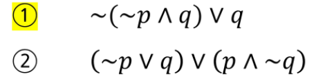

# 1. 논리와 증명


## 문제 1. 다음 명제들이 항진명제라는 것을 진리표를 이용해서 보이시오.




|  p   |  q   |  ~p  | (~p^q) | ~(~p^q) | ~(~p^q) v q |
| :--: | :--: | :--: | :----: | :-----: | :---------: |
|  T   |  T   |  F   |   F    |    T    |      T      |
|  T   |  F   |  F   |   F    |    T    |      T      |
|  F   |  T   |  T   |   T    |    F    |      T      |
|  F   |  F   |  T   |   F    |    T    |      T      |


## 문제 4. 명제식의 변형을 통하여 다음 명제를 간소화하시오.

* (p^~q)v(p^q)  

```
= p^(~qvq)
= p^(1)
= p
```

* (pv~q)^(~pv~q)

```
= (p^~p)v~q
= 0v~q
= ~q
```


## 문제 6. (직접 증명) n이 짝수이면 3n+5는 홀수임을 증명하라.

```
n = 2k
3n+5 = 6k+5 = 2(3k+2)+1 => 홀수
```


## 문제 7. n이 홀수이면 n^2+n은 짝수임을 증명하라.

```
n = 2k-1(k=1,2,3....)
n^2+n = 4k^2 - 4k + 1 + 2k -1
	  = 4k^2 - 2k
	  = 2(2k^2 - k) = > 짝수
```


## 문제 8. m이 짝수이고 n이 홀수이면 2m+3n은 홀수임을 증명하라.

```
m = 2k(k=1,2,3...)
n = 2p-1(p=1,2,3...)
2m+3n = 2(2k) + 3(2p-1)
      = 4k + 6p -3
      = 2(2k + 3p) -3     2k + 3p >= 5  k,p >=1  => 홀수
```


## 문제 10. n^2이 짝수이면 n은 짝수임을 증명하라.

```
if n = 2k-1(k=1,2,3..)
n^2 = 4k^2 - 4k + 1
	=2(2k^2 -2k) + 1 => 홀수
n+1이 홀수이면 n^2은 홀수다 => 참 , 대우도 참 
```


### 문제 12. n^2이 3의 배수이면 n은 3의 배수임을 증명하라.

```
 = > 대우 : n이 3의 배수가 아니라면 n^2 도 3의 배수가 아니다.

n = 3*k + 1

n^2 = 9*k^2 + 6\*k + 1

		= 3(3*k^2 + 2\*k) + 1


n = 3*k + 2

n^2 = 9*k^2 + 12\*k + 1

		=3(3*k^2 + 4\*k) + 1 
		
		
```


# 2. 수와 표현

### k개의 비트 => 0~2^k-1 까지 표현 가능

* 어떤 값 n 을 표현하기 위해 필요한 비트는?

  ```
  n <= 2^k - 1
  즉, log(n+1) <= k
  ```

* logn

  * 2의 몇 승이 n이 되느냐의 답
  * n을 표현하는 데 몇 비트가 필요한가의 답
  * 1로 시작해서 계속 두 배를 할 때 몇 번 하면 n이 되느냐의 답
  * n을 2로 계속 나눌 때 몇 번 나누면 거의 1이 되느냐에 대한 답

### 											### 컴퓨터 분야에서 로그의 밑은 항상 2 ###


## 문제 1. 2진수 표현에서 logn 비트로 표현할 수 있는 숫자 범위는?

​	0~n


## 문제 2. 스무고개가 이상적으로 진행된다고 할 때, 맞출 수 있는 답의 종류는 몇 가지 인가?

2^20 가지


## 문제 3. n이 충분히 큰 값일 때 다음 중 어느 값이 더 큰가?

=> 그래프로 생각해도됨.

* 2n  		<		 n^2
* 2^(n/2)     <      (3^n)^(1/2)
* 2^(nlogn)    <    n!
* log(2^(2n))   <   n^(3/2)


### 문제 4. x = loga(yz) 일 때 x를 2를 밑으로 하는 로그들로 표현하시오.

```
x = (log2(y) + log2(z))/log2(a)
```


## 문제 5. 역함수

```
1. f(x) = 2^(x+5) + 3
2. f(x) = 2^((x-1)/3) - 3
3. f(x) = log3((x+1)/2)
```


# 3. 집합과 조합론


## 문제 13. 52개의 카드를 이용해서 만들 수 있는 5개 카드 조합 중 같은 무늬의 카드가 정확히 3개인 경우는 몇가지인가?

```
4C3 * 13 * 48 * 44 / 2! 
```


### 문제 16. 52개 카드에서 5개 카드 조합을 만들 때, 숫자가 같은 카드가 한 쌍도 없는 경우는 몇가지인가?

```
52 * 48 * 44 * 40 * 36 / 5!
= 1317888
```


# 4. 기초 수식

* 시간 복잡도를 계산할 수 있음 


## 문제 1. T(n) = T(n-1) + 1, T(0) = 1


## 문제 2. T(n) = T(n-1) + n, T(0) = 1


## 문제 3. T(n) = T(n-1) + logn, T(0) = 1


## 문제 4. T(n) = T(n/2) + 1, T(1) = 1


## 문제 5. T(n) = T(n/2) + n, T(1) = 1


## 문제 6. T(n) = 2T(n/2) + n, T(1) = 1


## 문제 7. T(n) = 3T(n/2) + n, T(1) = 1


## 문제 8. T(n) = T(n-1) + 1/n, T(1) = 1


