# 트리(자료구조)

> 비선형 구조

* 한 개 이상의 노드로 이루어진 유한 집합.
* 부트리(subtree) 들로 이루어진 하나의 트리

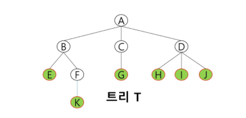

* 노드 : 트리의 원소

  * 루트 노드 : 트리의 시작 노드 (A)
  * 형제 노드 : 같은 부모 노드의 자식 노드들 (H, I, J)
  * 조상 노드 : 간선을 따라 루트까지 있는 모든 노드 (H의 조상: D, A)
  * 자손 노드 : 서브 트리에 있는 하위 레벨의 노드들 (B의 자손 : E, F, K)
  * 단말 노드 : 차수가 0인 끝에 있는 노드(리프 노드; E, K, G, H, I, J)

* 간선

  : 노드를 연결하는 선. 부모 노드와 자식 노드를 연결

* 차수
  * 노드의 차수 : 노드에 연결된 자식 노드의 수(B = 2, C = 1, D = 3)
  * 트리의 차수 : 트리에 있는 노드 차수중 가장 큰값 (트리 T의 차수 = 3)
* 높이

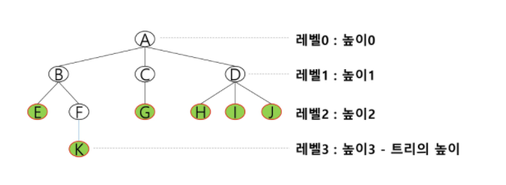


## 이진트리

> 모든 노드들이 2개의 서브트리를 갖는 특별한 형태의 트리
>
> 각 노드가 자식 노드를 최대한 2개 까지만 가질 수 있음(0개, 1개 , 2개 )

* 레벨 i에서의 노드의 최대 개수는 2^i개


### 포화 이진 트리

>모든 레벨에 노드가 포화상태로 차 있는 이진 트리

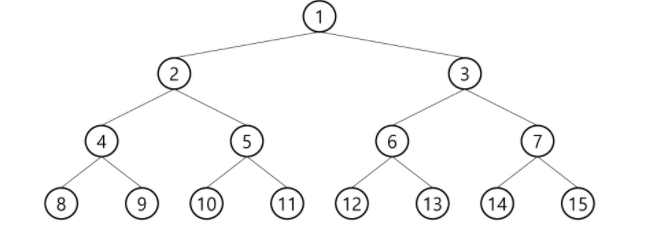


### 완전 이진 트리

>위에서 아래로 왼쪽에서 오른쪽으로 채운 트리
>
>포화 이진 트리가 아니어도 상관없음.

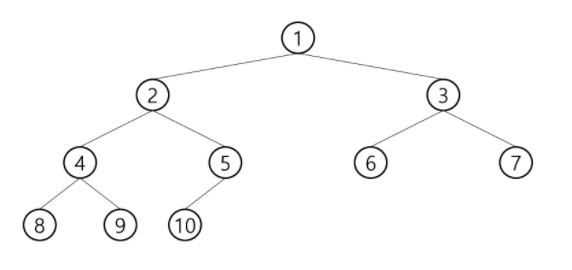


### 편향 이진 트리

> 높이 h에 대한 최소 개수의 노드(h+1)를 가지면서 한쪽 방향의 자식 노드만을 가진 이진트리
>
> 깊이가 깊어짐


### 순회

> 노드들을 빠짐없이 중복없이 체계적으로 방문하는 것.
>
> 선형구조가 아니기 때문에 선후연결관계 알수 없음.

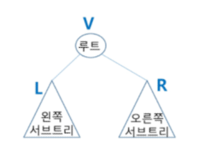

* 전위순회(VLR)

​			: 부모 -> 왼쪽 자식 -> 오른쪽 자식

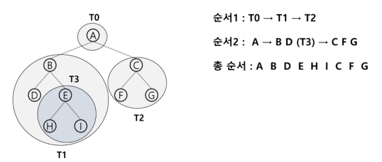

* 중위순회(LVR)

​			: 왼쪽 자식 -> 부모 ->  오른쪽 자식

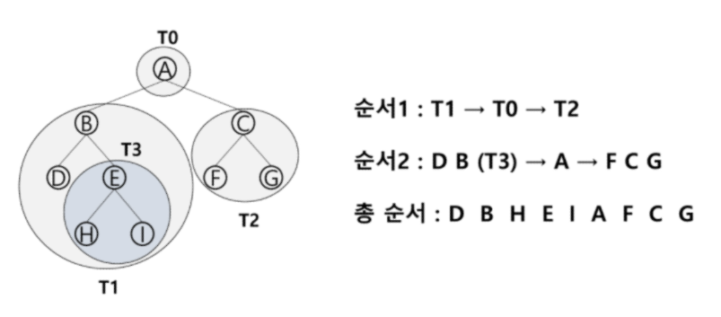

* 후위순회(LRV)

​			: 자식(순서 상관없거나 왼쪽) -> 부모 

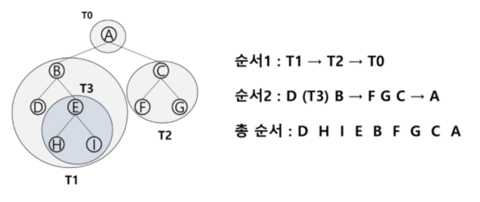


### (완전 or 포화)이진트리 표현 - 배열(완전 혹은 포화일때만)

1. n 개의 노드 -> n+1개짜리 배열
2. i번 노드의 부모 노드 : i//2
3. i 번의 왼쪽 자식 노드 : 2*i
4. i 번의 오른쪽 자식 노드 : 2*i + 1


### 이진트리 표현 - 배열 2개 사용

> 부모번호를 인덱스로
>
> 자식값 저장은 두개의 리스트로

````python
```
4
1 2 1 3 3 4 3 5
```
# 순회
def pre_order(v):
    if v:	# 자식이 있으면 순회
        print(v)	# visit(v)
        pre_order(ch1[v])
        pre_order(ch2[v])

def in_order(v):
    if v:
        in_order(ch1[v])
        print(v)
        in_order(ch2[v])
        
def post_order(v):
    if v:
        post_order(ch1[v])
        post_order(ch2[v])
        print(v)

E = int(input()) # edge 수(간선)
arr = list(map(int, input().split()))
V = E + 1  	# 정점 수 (node = 간선 + 1)

# 부모번호를 인덱스로 자식번호 저장하는 과정
ch1 = [0] * (V + 1)
ch2 = [0] * (V + 1)
for  i in range(E):
    p, c = arr[i*2], arr[i*2 + 1]	# 입력받은 값 2개씩 저장
    if ch1[p] == 0:
        ch1[p] = c
    else:
        ch2[p] = c
        
````


> root 및 조상 찾기 => 자식번호를 인덱스로 해서 부모번호 저장

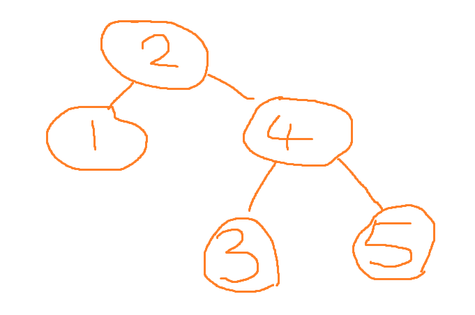

````python
```
4
2 1 2 4 4 3 4 5
```

# 자식 번호를 인덱스로 부모번호 저장
par = [0] * (V + 1)
for i in range(E):
    p, c = arr[i * 2], arr[i * 2 + 1]
    par[c] = p
print(*par) 
````

```
0 2 0 4 2 4
```

```python
# root찾기
for i in range(E):
    if par[i] == 0:
        root = i
        break
print(root)
```

```
2
```

```python
#조상찾기
c = 5 		# 5의 조상찾기
anc = [] 	# 조상 목록
while par[c] != 0:
    anc.append(par[c])
    c = par[c]
print(*anc)
```

```
4 2
```


### 트리 표현 - 연결 리스트

> 주소를 입력
>
> 시간 짧으나 구현 어려움

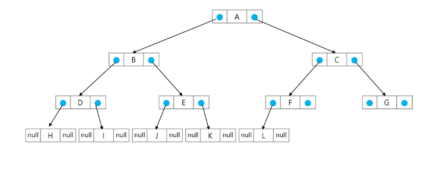


## 이진 탐색 트리

> 왼쪽 서브트리 < 루트 < 오른쪽 서브트리 를 만족하는 트리 자료구조
>
> 중위 순회하면 오름차순으로 정렬된 값을 얻을 수 있음.

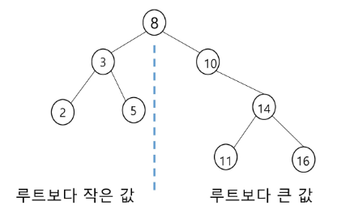

### 탐색연산

* 루트에서 시작
* 키 값 x와 루트 노드를 비교하면서 진행


### 삽입연산

* 탐색 연산과 같으나 탐색 실패시 삽입 => 탐색 성공하면 삽입불가이므로


### 삭제 연산

* 루트를 삭제 할 시
  * 왼쪽에서 가장 큰 값을 가져온다.
  * 오른쪽에서 가장 작은 값을 가져온다.

* 리프 노드를 삭제 할 시
  * 그냥 지우면 될듯.
* 가운데 노드를 삭제 할 시
  * 


## 힙(heap)

> **완전 이진 트리**에 있는  노드 중에서 키값이 가장 크거나 가장 작은 노드를 찾기 위해 만든 자료구조
>
> 최대 힙 - 루트가 가장 큼
>
> 최소 힙 - 루트가 가장 작음
>
> 힙에서는 루트 노드의 원소만 삭제 가능! => 루트노드값을 빼오고 새로운 루트 노드값을 찾는 과정

````python
```
최대 100개 정수
최대힙
```
# 삽입 연산
def enq(n):
    global last
    last += 1
    tree[last] = n	# 완전이진트리 유지
	c = last	# 새로 추가된 정점을 자식으로
    p = c//2 	# 완전이진트리에서의 부모 정점 번호
    while p>=1 and tree[p] < tree[c]:
        tree[p], tree[c] = tree[c], tree[p]
		c = p
        p = c//2
        
        
# 삭제 연산 => 루트값 꺼내기. last 뽑아서 다시 tree만들기
def deq():
    global last
    tmp = tree[1]	 # 루트 키 값
    tree[1] = tree[last] 		# 마지막 값
	last -= 1
    # 부모 > 자식 규칙 유지
    p = 1
    c = p * 2
    while c <= last:
        if c+1 <= last and tree[c]<tree[c+1]:
            c += 1
        if tree[p] < tree[c]:
            tree[p], tree[c] = tree[c], tree[p]
            p = c
            c = p * 2
        else:
            break
    return tmp


# 포화이진트리의 정점번호 1~100
tree = [0] * 101
last = 0 	# 마지막 정점 번호
````

