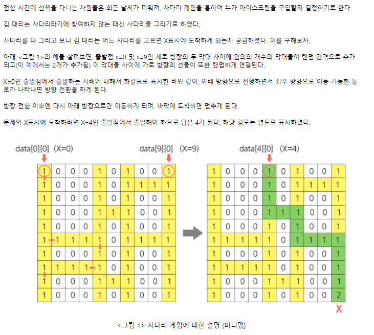

# 달팽이 문제


​                                                                         <출처: swea 달팽이 숫자>

## 델타 

```python
T = int(input())
for tc in range(1, T+1):
    N = int(input())
    arr = [[0] * N for _ in range(N)]
    
    di = [1, 0, -1, 0]
    dj = [0, 1, 0, -1]
    
    d = 1
    i = 0
    j = 0
    k = 0
    while d <= N * N:    # N^2 보다 작으면 작성
        if 0<=i<N and 0<=j<N and arr[i][j] == 0:
            arr[i][j] = d
            i, j = i + di[k], j + dj[k]
            d += 1
        else:
            i, j = i - di[k], j - dj[k]
            k = (k+1) % 4
            i, j = i + di[k], j + dj[k]
```


## index 

```python
T = int(input())
# 여러개의 테스트 케이스가 주어지므로, 각각을 처리합니다.
for test_case in range(1, T + 1):
    N = int(input())
    snail_list = []
    for i in range(N):
        snail_list += [[0 for j in range(N)]]                            # N x N 행렬 일단 만들어주고
    m = 0
    k = 0
    num = N
    while m <= int(num/2):
        for i in range(N):
            snail_list[m][i+m] = i + 1 + k
        for i in range(N):
            snail_list[num-1-m][i+m] = 3*N -i -2 + k
        for i in range(1,N):
            snail_list[i+m][m] = 4*N -3 -i + k
        for i in range(1,N):
            snail_list[i+m][num-1-m] = N + i + k
        N -= 2
        m += 1
        k += 4 * num -4 *(2*m-1)
    print(f'#{test_case}')  
    for i in range(num):
        for j in range(num):
            print(snail_list[i][j], end = ' ')
        print('')
```


## 답 체크 하는 Tip

diffchecker.com

output 과 내 정답 비교해주는 사이트


## 선택 정렬


```python
for i in range(10):
    if i%2 == 0:                                    #짝수 일때
        maxIdx = i                                  #max인덱스를 처음 값이라고 가정
        for j in range(i+1, N):
            if arr[maxIdx] < arr[j]:                #가정보다 큰 값이 나오면
                maxIdx = j                          #새로 지정
        arr[i], arr[maxIdx] = arr[maxIdx], arr[i]   #2개 동시 교환
    else:
        minIdx = i
        for j in range(i+1, N):
            if arr[minIdx] > arr[j]:
                maxIdx = j
        arr[i], arr[minIdx] = arr[minIdx], arr[i]
        
```


# 이진 탐색


​                                      <출처: swea 이진탐색 문제>

```python
T = int(input())
# 여러개의 테스트 케이스가 주어지므로, 각각을 처리합니다.
for test_case in range(1, T + 1):
    print(f'#{test_case}',  end = ' ')
    P, Pa, Pb = map(int, input().split())
    def search(page, want_page):
        cnt = 0
        left = 1
        right = page
        bi_page = int((right+left)/2)
        while bi_page != want_page:
            if want_page > bi_page:                     # 원하는 페이지가 더 크면
                left = bi_page                          #left 값만 다시 설정
                bi_page = int((right + left) / 2)
                cnt += 1
            elif want_page < bi_page:
                right = bi_page
                bi_page = int((right + left) / 2)
                cnt += 1
            else:
                cnt += 1
                break
        return cnt
    if search(P, Pa) < search(P, Pb):
        print('A')
    elif search(P, Pa) > search(P, Pb):
        print('B')
    else:
        print(0)
```


# ladder



<출처 : swea ladder1 문제>

```python
T = 10
# 여러개의 테스트 케이스가 주어지므로, 각각을 처리합니다.
for test_case in range(1, T + 1):
    N = int(input())
    arr = [[0] + list(map(int, input().split())) + [0] for _ in range(100)]  # 100 x 102 양쪽에 0을 넣어서 indexError 안나게
    start = 0
 
    for i in range(102):            										 # 목표지점을 찾고 목표지점 부터 시작하는 방식
        if arr[99][i] == 2:
            start = i
 
    i = 99                               
    j = start
    while i != 0:               											# i = 99 에서 시작하여 0이 될때까지 반복
        if arr[i][j-1] == 1:												# 왼쪽에 경로가 있으면 왼쪽 끝까지 가도록
            while arr[i][j] != 0:
                j -= 1
            j += 1															# j 가 기존 경로보다 하나 더 들어갔기 때문에 원상복구
            i -= 1							
            elif arr[i][j+1] == 1:											# 오른쪽 경로		
            while arr[i][j] != 0:
                j += 1
            j -= 1
            i -= 1
        else:
            i -= 1
        if i == 0:
            break
 
    print(f'#{test_case} {j-1}')
```

