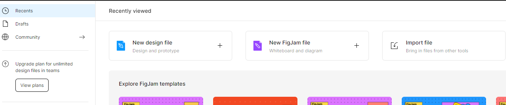

# Figma

> https://www.figma.com/
>
> UI/UX 디자인 tool

## 인터페이스

* 새 파일 만들기 (Ctrl + n)

* 기능 검색 (Ctrl + /)

* Move & Scale
  * Move(v) : 오브젝트들을 선택하는 툴
  * Scale(k) : 오브젝트의 크기를 변경할 수 있는 툴

* Frame와 Slice
  * Frame(f) : 포토샵이나 일러스트레이터 혹은 XD의 아트보드와 같은 툴
  * Slice(s) : 저장하고자 하는 부분을 슬라이스 처리하는 툴

| 기능검색        | Ctrl + /                 |
| --------------- | ------------------------ |
| 오브젝트 복제   | Ctrl + D                 |
| 투명도 조절     | 숫자키 0~9               |
| 그룹            | Ctrl + G                 |
| 그룹해제        | Ctrl + Shift + G         |
| 눈금자          | Shift + R                |
| 확대            | Ctrl + +/ Ctrl + 휠(위)  |
| 축소            | Ctrl + -/Ctrl + 휠(아래) |
| 컴포넌트 만들기 | Ctrl + Alt + K           |

