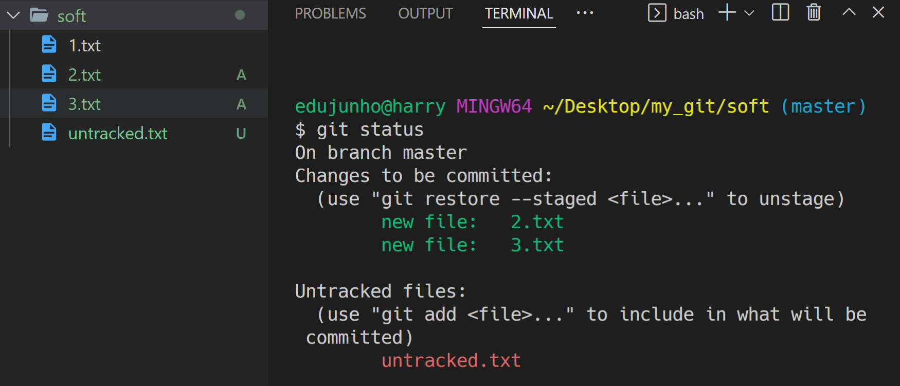
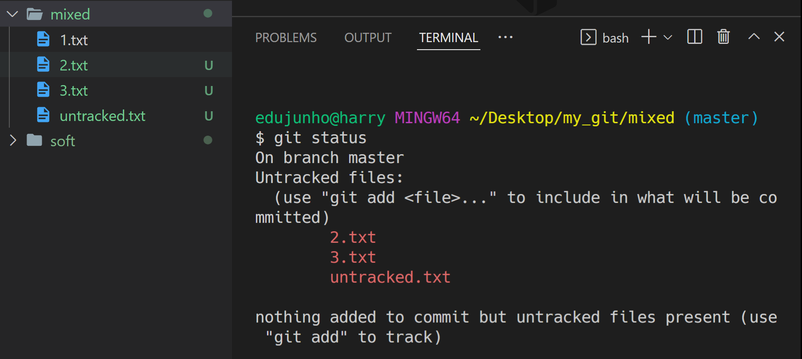
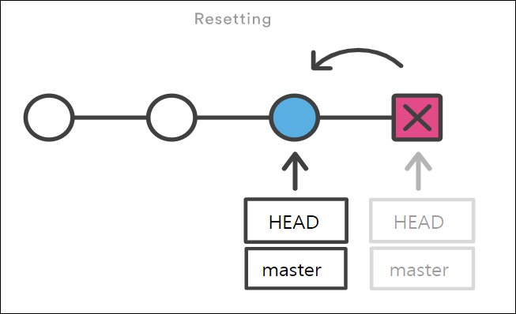

# Git

> **Version Control Systems**

1. 버전 관리

​	

2. 협업


### Github vs Git

> Github : 단순히 git을 인터넷에서 사용할 수 있게 서버를 제공해주는 서비스
>
> Git : 실제 버전 관리 시스템


### Git 의 차별성

> Git은 데이터를 파일로 처리x
>
> 파일 시스템의 스냅샷의 연속으로 취급
>
> 이전 상태의 파일에 대한 링크만 저장하기 때문에 크기가 작음

### 스냅샷 : 스**냅샷**은 마치 사진 찍듯이 특정 시점에 스토리지의 파일 시스템을 포착해 보관하는 기술


### Git 상태


* Modified : 파일이 수정중인 상태. local에서의 변화
* Staged : commit이 되기 이전 상태.
* Committed : 수정사항들이 local git환경에 저장되있는 상태.


### add 와 commit 을 나눠놓은 이유 

### * commit 시기를 놓쳤을 때 원하는 파일만 commit하기 위해 *


### branch & merge


## Git 설치

1. git-scm.com 


2. Download for WIndows


## 명령어

* pwd : 위치 알려줌
* cd
* ls -al : 현재 파일 정보
* cp : copy
* cat


## git  명령어 -> https://git-scm.com/docs/git

* git init
* git status
* git add
* git config
* git status
* git log
* git diff
* git reset
* git revert
* git branch
* git stash
* git switch
* git restore


## git help

```bash
$ git 명령어 --help  ==> 명령어에 대한 옵션등 다양한 정보 나옴.
```


## git init

> Create an empty Git repository or reinitialize an existing one
>
> local 저장소로 설정

* .git 생성


## git add

> git이 track할 파일을 추가하는 명령어.

```bash
$ git add 파일명

```


## git config

> Get and set repository or global options
>
>


## git log

* git log
* git log -p : commit과 commit 사이의 source 차이를 확인 가능
  * -가 이전버전
  * +가 이후 버전
* git log --oneline
* git log --oneline --all


## git diff

* git diff commit1주소 .. commit2주소 => commit1과 commit2의 차이를 알려줌


# Undoing Things

> "되돌리기"

## 1. 파일 내용을 수정 전으로 되돌리기

> "Unmodifying a Modified File"

- Modified 파일 되돌리기
- Working Directory에서 파일을 수정했다고 가정해봅시다.
  - 만약 이 파일의 수정 사항을 취소하고, 원래 모습대로 돌리려면 어떻게 해야 할까요?

### (1) git restore

- `git restore <파일 이름>`의 형식을 사용합니다.
- git의 추적이 되고 있는, 즉 버전 관리가 되고 있는 파일만 되돌리기가 가능합니다.

1. 이미 버전 관리가 되고 있는 test.md 파일을 변경 후 저장(save)합니다.

   ```markdown
   # test.md
   
   Hello
   World <- "World"라는 새로운 내용 추가
   -------------------------------------
   이후 저장
   ```

2. `test.md`는 modified 상태가 되었습니다.

   ```shell
   $ git status
   On branch master
   Changes not staged for commit:
     (use "git add <file>..." to update what will be committed)
     (use "git restore <file>..." to discard changes in working directory)
           modified:   test.md
   
   no changes added to commit (use "git add" and/or "git commit -a")
   ```

3. git restore를 통해 수정 전으로 되돌립니다.

   ```shell
   $ git restore test.md
   ```

   ```markdown
   # test.md
   
   Hello
   -------------------------------------
   World가 삭제 되면서, 수정 전으로 되돌아감
   ```

> **[중요]**
>
> - 원래 파일로 덮어썼기 때문에 수정한 내용은 전부 사라짐
> - 한 번 git restore를 통해 수정을 취소하면, 해당 내용을 복원할 수 없음

> **[참고사항]**
>
> ```shell
> # Git(2.23.0 이전)에서는 아래 명령어를 사용했음
> 
> $ git checkout -- <파일 이름>
> ```

------

## 2. 파일 상태를 Unstage로 되돌리기

> "Unstaging a Staged File"

- Staging Area와 Working Directory 사이를 넘나드는 방법
- git add를 통해서 파일을 Staging Area에 올렸다고 가정해봅시다.
  - 만약 이 파일을 다시 Unstage 상태로 내리려면 어떻게 해야 할까요?
  - 두 가지 상황으로 나누어 살펴보겠습니다.

### (1) git rm --cached

1. 새 폴더에서 git 초기화 후 진행 `test.md` 파일을 생성하고 git add를 진행

   ```shell
   $ touch test.md
   ```

   ```shell
   $ git add test.md
   ```

   ```shell
   $ git status
   On branch master
   
   No commits yet
   
   Changes to be committed:
     (use "git rm --cached <file>..." to unstage)
           new file:   test.md
   ```

2. Staging Area에 올라간 test.md를 다시 내리기(unstage)

   ```shell
   $ git rm --cached test.md
   rm 'test.md'
   ```

   ```shell
   $ git status
   On branch master
   
   No commits yet
   
   Untracked files:
     (use "git add <file>..." to include in what will be committed)
           test.md
   
   nothing added to commit but untracked files present (use "git add" to track)
   ```

### (2) git restore --staged

- 두번째 상황 전 사전 준비

  ```shell
  $ git add .
  $ git commit -m "first commit"
  ```

1. `test.md`의 내용을 변경하고 git add를 진행

   ```shell
   # test.md 파일 변경 후
   $ git add test.md
   ```

   ```shell
   $ git status
   On branch master
   Changes to be committed:
     (use "git restore --staged <file>..." to unstage)
           modified:   test.md
   ```

2. Staging Area에 올라간 test.md를 다시 내리기(unstage)

   ```shell
   $ git restore --staged test.md
   ```

   ```shell
   $ git status
   On branch master
   Changes not staged for commit:
     (use "git add <file>..." to update what will be committed)
     (use "git restore <file>..." to discard changes in working directory)
           modified:   test.md
   
   no changes added to commit (use "git add" and/or "git commit -a")
   ```

> **[중요]**
>
> Unstage로 되돌리는 명령어가 다른 이유는 무엇일까?
>
> 1. ```
>    git rm --cached <file>
>    ```
>
>    - **기존에 커밋이 없는 경우**
>    - “to unstage and remove paths only from the staging area”
>
> 2. ```
>    git restore --staged <file>
>    ```
>
>    - **기존에 커밋이 존재하는 경우**
>    - “the contents are restored from HEAD”

> **[참고사항]**
>
> ```shell
> # Git(2.23.0 이전)에서는 아래와 같은 명령어 사용
> 
> $ git reset HEAD <파일 이름>
> ```

------

## 3. 바로 직전 완료한 커밋 수정하기

> 만약 A라는 기능을 완성하고 `"A 기능 완성"`이라는 커밋을 남겼다고 가정해봅시다.
>
> 그런데.. A 기능에 필요한 파일 중 1개를 빼놓고 커밋 했다는 걸 뒤늦게 깨달아 버렸습니다.
>
> 직전 커밋을 취소하고, 모든 파일을 포함해서 다시 커밋 하려면 어떻게 해야 할까요?

### (1) git commit --amend

- 상황별 2가지 기능
  1. 커밋 메시지만 수정
     - 마지막으로 커밋하고 나서 수정한 것이 없을 때 (커밋하자마자 바로 이 명령을 실행하는 경우)
  2. 이전 커밋 덮어쓰기
     - Staging Area에 새로 올라온 내용이 있을 때

#### 1-1. 커밋 메시지만 수정하는 경우

1. A 기능을 완성하고 커밋합니다.

   ```shell
   $ git commit -m 'B feature completed'
   ```

2. 현재 커밋 해시 값 확인해두기

   ```shell
   $ git log
   ```

3. 커밋 메시지 수정을 위해 다음과 같이 입력합니다.

   ```shell
   $ git commit --amend
   
   hint: Waiting for your editor to close the file..[master c01f908] Add no.txt
   ...
   ```

4. Vim 편집기가 열리면서 직전 커밋 메시지를 수정할 수 있습니다.

   ```shell
   B feature completed
   
   # Please enter the commit message for your changes. Lines starting
   # with '#' will be ignored, and an empty message aborts the commit.
   #
   # Date:      Wed Jan 12 01:25:10 2022 +0900
   #
   # On branch master
   #
   # Initial commit
   #
   # Changes to be committed:
   #       new file:   test.txt
   ```

5. 커밋 메세지를 수정하고 저장하면, 새로운 메세지로 변경되며 커밋 **해시 값 또한 변경됨**

   ```shell
   $ git log
   ```

#### 1-2. 커밋 재작성

1. 실수로 bar.txt를 빼고 커밋 해버린 상황까지 만들어 봅시다.

   ```shell
   $ touch foo.txt bar.txt
   $ git add foo.txt
   ```

   ```shell
   $ git status
   On branch master
   Changes to be committed:
     (use "git restore --staged <file>..." to unstage)
           new file:   foo.txt
   
   Untracked files:
     (use "git add <file>..." to include in what will be committed)
           bar.txt
   ```

   ```shell
   $ git commit -m "foo & bar"
   
   [master 4221af6] foo & bar
    1 file changed, 0 insertions(+), 0 deletions(-)
    create mode 100644 foo.txt
   ```

   ```shell
   $ git status
   
   On branch master
   Untracked files:
     (use "git add <file>..." to include in what will be committed)
           bar.txt
   ```

2. 누락된 파일을 staging area로 이동 시킵니다.

   ```shell
   $ git add bar.txt
   
   $ git status
   On branch master
   Changes to be committed:
     (use "git restore --staged <file>..." to unstage)
           new file:   bar.txt
   ```

3. `git commit --amend` 를 입력합니다

   ```shell
   $ git commit --amend
   ```

4. Vim 편집기가 열립니다. (마찬가지로 커밋 메시지도 수정가능)

   ```shell
   foo & bar
   
   # Please enter the commit message for your changes. Lines starting
   # with '#' will be ignored, and an empty message aborts the commit.
   #
   # Date:      Mon Jun 7 22:32:58 2021 +0900
   #
   # On branch master
   # Changes to be committed:
   #       new file:   bar.txt
   #       new file:   foo.txt
   ```

5. Vim 편집기를 저장 후 종료하면 직전 커밋이 덮어 씌워집니다. (커밋이 새로 추가된 것이 아님) 마찬가지로 커밋 **해시 값 또한 변경됨**

   ```shell
   $ git commit --amend
   
   [master 7f6c24c] foo & bar
    Date: Mon Jun 7 22:32:58 2021 +0900
    2 files changed, 0 insertions(+), 0 deletions(-)
    create mode 100644 bar.txt
    create mode 100644 foo.txt
   ```

6. `git log -p` 를 사용하여 직전 커밋의 변경 내용을 살펴봅니다.

**장점**

- `--amend` 옵션으로 커밋을 고치는 작업이 주는 장점은 마지막 커밋 작업에서 뭔가 빠뜨린 것을 넣거나 변경하는 것을 새 커밋으로 분리하지 않고 하나의 커밋에서 처리하는 것
- 예를들면, “앗, 빠진 파일 넣었음”, “이전 커밋에서 오타 살짝 고침” 등의 커밋을 만들지 않겠다는 말

> **[중요]**
>
> - 이렇게 --amend 옵션으로 커밋을 고치는 작업은, 추가로 작업한 일이 작다고 하더라도 이전의 커밋을 완전히 새로 고쳐서 새 커밋으로 변경하는 것을 의미함
> - 이전의 커밋은 일어나지 않은 일이 되는 것이고, 당연히 히스토리에도 남지 않음


## git reset vs git revert

```bash
$ git reset commit주소 --hard  => commit주소의 상태로 돌아감 (이후의 버전을 지운것은 아니다.)
						
```


# Reset & Revert

> 공통점
>
> - '과거로 되돌린다.'
>
> 차이점
>
> - '과거로 되돌리겠다는 내용도 기록되는가 (== commit 이력에 남는가)’

## 1. git reset

> 가끔 앱을 사용하다가 업데이트를 했는데, 오히려 예전 버전이 더 좋다고 느낄 때가 있습니다.
>
> 이처럼 만약 여러분들이 예전 버전으로 돌아가고 싶을 땐 어떻게 해야할까요?

**명령어**

```shell
$ git reset [옵션] <커밋 ID>
```

- **시계를 마치 과거로 돌리는 듯한 행위**로써, 특정 커밋 상태로 되돌아갑니다.
- 특정 커밋으로 되돌아 갔을 때, 해당 커밋 이후로 쌓아 놨던 커밋들은 전부 사라집니다.

**옵션**

- `옵션`은 아래와 같이 세 종류가 있으며, 생략 시 `--mixed`가 기본 값입니다.
  1. `--soft`
     - **돌아가려는 커밋으로 되돌아가고**,
     - 이후의 commit된 파일들을 `staging area`로 돌려놓음 (commit 하기 전 상태)
     - 즉, 다시 커밋할 수 있는 상태가 됨
  2. `--mixed`
     - **돌아가려는 커밋으로 되돌아가고**,
     - 이후의 commit된 파일들을 `working directory`로 돌려놓음 (add 하기 전 상태)
     - 즉, unstage 된 상태로 남아있음
     - 기본 값
  3. `--hard`
     - **돌아가려는 커밋으로 되돌아가고**,
     - 이후의 commit된 파일들(`tracked 파일들`)은 모두 working directory에서 삭제
     - 단, Untracked 파일은 그대로 Untracked로 남음

### 옵션별 결과

> 돌아가려는 커밋(first) 이후에 커밋된 `2.txt`, `3.txt`가 어떻게 처리되는지 확인하기

- 시작 전 커밋 확인

  ```shell
  $ git log --oneline
  20d320d (HEAD -> master) third
  1eb059e second
  6baf32f first
  ```

1. `--soft`

   ```shell
   $ git reset --soft 6baf
   ```

   

2. `--mixed`

   ```shell
   $ git reset 6baf
   ```

   

3. `--hard`

   ```shell
   $ git reset --hard 6baf
   ```

   

- 옵션 한눈에 보기 


- 그림으로 이해하는 `git reset`

  

> 이전 커밋으로 돌아가고, 돌아간 커밋 이후의 내역은 사라집니다.

> **[참고사항]**
>
> 혹시나 이미 삭제한 커밋으로 다시 돌아가고 싶다면? → `git reflog`를 사용합니다.
>
> ```shell
> $ git reflog
> 1a410ef HEAD@{0}: reset: moving to 1a410ef
> ab1afef HEAD@{1}: commit: modified repo.rb a bit
> 484a592 HEAD@{2}: commit: added repo.rb
> 
> $ git reset --hard <복구하고자 하는 커밋ID>
> 
> # git reflog 명령어는 HEAD가 이전에 가리켰던 모든 커밋을 보여줍니다.
> # 따라서 --hard 옵션을 통해 지워진 커밋도, reflog로 조회하여 돌아갈 수 있습니다.
> ```

------

## 2. git revert

> `git reset`은 쉽게 과거로 돌아갈 수 있다는 장점이 있지만, 커밋 내역이 사라진다는 단점이 있습니다.
>
> 따라서 다른 사람과 협업할 때 커밋 내역의 차이로 인해 충돌이 발생할 수 있습니다.

**명령어**

```shell
$ git revert <커밋 ID>
```

- **특정 사건을 없었던 일로 만드는 행위**로써, `이전 커밋을 취소한다는 새로운 커밋`을 만듭니다.
- `git reset`은 커밋 내역을 삭제하는 반면, `git revert`는 새로 커밋을 쌓는다는 차이가 있습니다.

**사용 예시**

- 시작 전 커밋 확인

  ```shell
  $ git log --oneline
  20d320d third
  1eb059e second
  6baf32f first
  ```

- second 커밋으로 revert

  ```shell
  $ git revert 1eb059
  ```

- vim 편집기가 나오면 저장 후 종료

  ```shell
  $ git log --oneline
  f0b5364 (HEAD -> master) Revert "second" # 새로 쌓인 커밋
  20d320d third
  1eb059e second # 히스토리는 남아있음
  6baf32f first
  ```

- second 커밋에서 있었던 `2.txt`가 사라진 것을 확인(second 커밋을 없었던 일로 만든 것)

  

- 그림으로 이해하는 `git revert`

  

> 이전 커밋을 취소했다는 새로운 커밋을 생성합니다. (이전 커밋은 그대로 살아있습니다.)

> **[중요]**
>
> `git reset`과 비슷하다는 이유로 다음 사항이 혼동될 수 있습니다.
>
> - `git reset --hard 5sd2f42`라고 작성하면 5sd2f42라는 커밋`으로` 돌아간다는 뜻입니다.
> - `git revert 5sd2f42`라고 작성하면 5sd2f42라는 커밋`을` 되돌린다는 뜻입니다.

> **[참고사항]**
>
> ```shell
> # 공백을 통해 여러 커밋을 한꺼번에 되돌리기 가능
> $ git revert 7f6c24c 006dc87 3551584
> 
> # 범위 지정을 통해 여러 커밋을 한꺼번에 되돌리기 가능
> $ git revert 3551584..7f6c24c
> 
> # 커밋 메시지 작성을 위한 편집기를 열지 않음 (자동으로 커밋 완료)
> $ git revert --no-edit 7f6c24c
> 
> # 자동으로 커밋하지 않고, Staging Area에만 올림 (이후, git commit으로 수동 커밋)
> # 이 옵션은 여러 커밋을 revert 할 때 하나의 커밋으로 묶는게 가능
> $ git revert --no-commit 7f6c24c
> ```


## ##reset은 local에서만 !!! push한 폴더에서는 reset 금지!!!##


```bash
revert는 commit을 취소하면서 새로운 버전 형성
```


## Gistory

```bash
$ pip install gistory

$ cd .git

$ gistory


## add 할 때마다 index 와 objects가 변함.
=> git은 파일을 저장하는 것이 아니라 주소를 저장한다.

## commit을 하면 objects 안에 commit 한 사람의 정보(config)가 들어간다.

## status 는 objects와 실제 파일을 비교해서 알려줌.
```


## branch

> 새로운 가지를 만드는 과정

* git 의 branch 기능은 다른 서버관리툴보다 가볍고, 쓰기 편하다.


* `git branch` : 목록
* `git branch 브랜치이름` : 생성
* `git branch -d 브랜치이름` : 삭제
* `git branch -D 브랜치이름` : 합병 없어도 삭제
* `git switch 브랜치이름` : 이동
* `git switch -c 브랜치이름` : 생성 후 이동 


### branch 만들기

```bash
a.txt
b.txt

$ git branch
* master

$ git branch exp
 exp
* master

$ git checkout exp
Switched to branch 'exp'

$ git branch
* exp
  master
=> branch가 exp로 바뀜  master와 exp가 같은 상태

a.txt 수정

$ git add a.txt

$ git commit -m '3'

$ git log  ---------- 1

$ git checkout master

$ git log   --------- 2

1 과 2의 로그 상태는 '3'의 유무로 다르다
폴더 내 파일 상태도 다르다.


```


### branch 정보확인

```bash
$ git log -- branches
```

```bash
=> checkout이 아닌 branch 들의 로그를 보여줌
```


```bash
$ git log --branches --decorate --graph
```


```bash
$ git log --branches --decorate --graph --oneline
```


```bash
$ git log master..exp
=> master 에는 없고 exp 에만 있는 로그를 보여줌

$ git log exp..master
=> exp에는 없고 master에만 있는 로그를 보여줌

$ git diff master..exp
=> -가 master + 가 exp
```


### branch merge

* exp  => master 하려면 일단 checkout master

```bash
$ git merge exp
```


```bash
$ git log --branches --decorate --graph --oneline
```


=> master는 1 2 5 3 log 를 다 갖고 있다.

   exp는 1 2 3 을 갖고 있다.

```bash
$ git checkout exp
$ git merge master
$ git log --branches --decorate --graph --oneline
```


```bash
$ git checkout master
$ git branch -d exp  # exp 브랜치 삭제
$ git log --branches --decorate --graph --oneline
```


### git stash

> 숨겨놓는(?) 감추다(?)
>
> branch 작업 안끝남 -> 다른 branch 가야 할 상황이 생김ㅁ
>
> commit하기도 애매하고 그럴 때 stash로 잠깐 숨겨놓는다.

master branch 에서 작업하던 것을 commit 하지 않고 

exp branch로 넘어왔을 때 master 수정본이 문제가 됨.

=> stash로 숨겨주면 됨


```bash
$ git stash => 숨겨줌

$ git stash apply => 숨겨준거 다시 보여줌

$ git stash drop => list에 있는 최신 stash 제거

$ git stash apply ; git stash drop => 동시에 적용 = $ git stash pop
```


