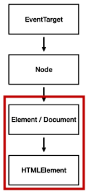
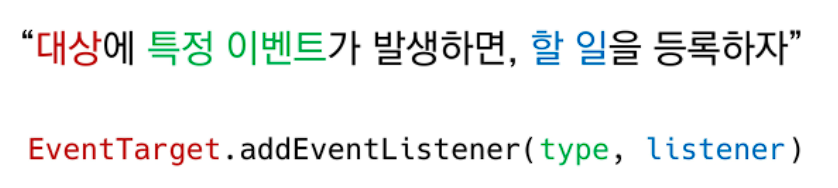

# DOM

> Document Object Model
>
> 결국 문서 (HTML) 조작
>
> 1. 선택  2. 변경 으로 모든 작업 가능


## 상속 구조



* EventTarget
  * Event Listener 를 가질 수 있는 객체가 구현하는 DOM 인터페이스 
  * => 최상위 존재하기 때문에 window도 가능
* Node
  * 여러 가지 DOM 타입들이 상속하는 인터페이스
* Element
  * Document 안의 모든 객체가 상속하는 가장 범용적인 인터페이스
* Document
  * 브라우저가 불러온 웹 페이지
  * DOM 트리의 진입점 
* HTMLElemnet
  * 모든 종류의 HTML 요소


## DOM 선택

### document.querySelector(selector)

* 제공한 선택자와 일치하는 element 하나 선택
* 제공한 CSS selector 를 만족하는 첫 번째 **element 객체를 반환**(없으면 null)

```javascript
const h1 = document.querySelector('h1')
const h2 = document.querySelector('h2')
const secondH2 = document.querySelector('#location-header')
const selectUlTag = document.querySelector('div > ul')
```


### document.querySelectorAll(selector)

* 제공한 선택자와 일치하는 모든 element를 선택
* 지정된 셀렉터에 일치하는 **NodeList를 반환**

```javascript
const liTags = document.querySelectorAll('li')
const secondLiTags = document.querySelectorAll('.ssafy-location')
```


### getElementById, getElementsByTamgName, getElementsByClassName

> id, class, tag 선택자 등을 모두 사용 가능한 querySelector, querySelectorAll을 사용하자!


### HTMLCollection & NodeList

* 둘 다 배열과 같이 index를 제공

* HTMLCollection

  * name, id, index 속성으로 각 항목에 접근 가능
  * Live Collection

* NodeList

  * index로만 각 항목 접근 가능

  * forEach 메서드 및 메서드 사용 가능

  * querySelectorAll()에 의해 반환 되는 NodeList만 Static,

    


## DOM 변경

### document.createElement()

* 작성한 태그 명의 HTML 요소를 생성하여 반환

```javascript
const footer = document.createElement('footer') // footer element 생성
```


### Element.append()

* DOMString, Node객체 추가 가능
* 반환 값 없음
* 여러 Node 객체 추가 가능


### Node.appendChild()

* 문자열 추가 불가
* 추가된  Node 객체 반환
* 하나의 Node 객체만 추가 가능


### Node.innerText

```javascript
liTag1.innerText = '<li>춘천</li>'
```

=> 문자열로 받기 때문에 그대로 출력


### Element.innerHTML

```javascript
liTag2.innerHTML = '<li>춘천</li>'
```

=> HTML로 인식하므로 새로운 춘천 리스트 추가됨.

=> XSS(Cross-site Scripting)

* 공격자가 입력요소를 사용하여 input 하면 문제 발생
* 쓰지말자


## DOM 삭제

### ChildNode.remove()

* 인자로 들어간 Node 제거 
* 자식 Node 들은 그대로 


### Node.removeChild()

* 첫번째 자식 Node 제거
* 삭제된 Node 반환

```javascript
const parent = document.querySelector('ul')
const child = document.querySelector('ul > li')
const removedChildh = parent.removeCild(child)
console.log(removedChild)
```


## DOM 속성

### Element.setAttribute(name, value)

* 지정된 요소의 값을 설정
* 속성이 이미 존재하면 값을 갱신, 존재하지 않으면 새롭게 추가


### Element.getAttribute(attributeName)

* 해당 요소의 지정된 값(문자열)을 반환
* 인자는 값을 얻고자 하는 속성의 이름 


# Event

# "~ 하면 ~ 한다."





### 인라인 스타일 안쓰듯 인라인 스크립트는 쓰지 않는다.

* 버튼을 누르면 메롱 alert 가 나오도록

```javascript
const alertMessage = function () {
      alert('메롱!!!')
    }

const myButton = document.querySelector('#my-button')
myButton.addEventListener('click', alertMessage)
```

#### 함수를 넣어줄 때 ()는 넣는 것이 아님.

=> 함수 자체를 넣는 것. return값이 없다면 ()로 넣어주면 undefined 와 같음.

=> django urls.py path 생각해보면 views.index (O)  views.index() (X)


=> alert('메롱') 함수를 변수에 넣을 필요가 없음

```javascript
const myButton = document.querySelector('#my-button')
myButton.addEventListener('click', function (evet){
    alert('메롱!!')
})
```


* input이 올때마다(키보드 칠때마다) 친대로 색이 바뀌게

```javascript
const h2Tag = document.querySelector('h2')    // 매번 동작할 필요 없음
const colorInput = document.querySelector('#change-color-input')
colorInput.addEventListener('input', function(event) {
    const userInput = event.target.value
    h2Tag.style.color = userInput
})
```

```
(event) 는 addEventListener 가 알아서 생성해주는 것
=> django의 request 같은 것 
```


## Event 취소


### event.preventDefault()

* default 된 동작을 하지 못하도록 함.
* ex) a 태그의 링크 이동을 막음.


