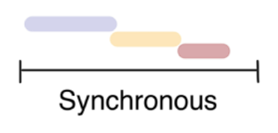
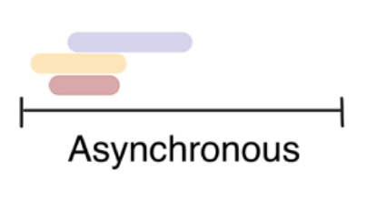
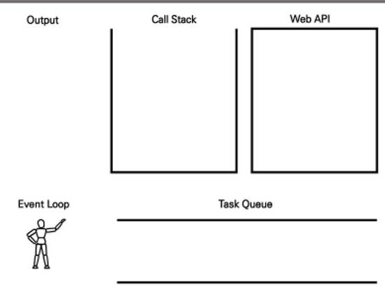

# AJAX

> Asynchronous JavaScript And XML(비동기식 JavaScript, XML)
>
> reload(새로고침) 하지 않고서 수행되는 "비동기성"

* 서버와 통신하기 위해 XMLHttpRequest 객체를 활용
* XML : eXtended Markup Language


* 요즘은 XML보다 더 가벼운 용량과 JavaScript로 인해 json을 더 많이 사용함
* 구글 맵 => 휠을 당기거나 옆으로 이동하는 모든 것이 event 바로바로 정보들을 받음


### XMLHttpRequest 객체

> 서버와 상호작용하기 위해 사용되며, 새로고침 없이 데이터를 받아올 수 있음
>
> 사용자의 작업 방해 없이 페이지 일부 업데이트 가능

* 생성자 XMLHttpRequest()

```javascript
// new 는 인스턴스 생성
const request = new XMLHttpRequest()
const URL = 'https://jsonplaceholder.typicode.com/todos/1'

request.open('GET', URL)
console.log('start')
request.send()
const todo = request.response
console.log('end')
```

```
console창에 todo 출력되지 않음 => 데이터 응답을 기다리지 않고 console.log()가 먼저 실행됐기 때문
request.send() 는 요청을 기다리지않음 => line by line 으로 하면 결과 나오는 이유
```


### 속성

* XMLHttpRequest.response
  * 응답 엔티티 바디를 갖는하는 [`XMLHttpRequest.responseType` (en-US)](https://developer.mozilla.org/en-US/docs/Web/API/XMLHttpRequest/responseType) 의 값에 따라 [`ArrayBuffer`](https://developer.mozilla.org/ko/docs/Web/JavaScript/Reference/Global_Objects/ArrayBuffer), [`Blob`](https://developer.mozilla.org/ko/docs/Web/API/Blob), [`Document`](https://developer.mozilla.org/ko/docs/Web/API/Document), JavaScript 객체, 또는 [`DOMString`](https://developer.mozilla.org/ko/docs/Web/API/DOMString) 을 반환합니다.


### 메서드

* XMLHttpRequest.open()

  * 요청을 초기화합니다. 이 메소드는 네이티브 코드로부터의 요청을 초기화하기 위해 JavaScript 코드에 의해 사용됩니다. 대신 [`openRequest()`](https://developer.mozilla.org/en-US/docs/Mozilla/Tech/XPCOM/Reference/Interface/nsIXMLHttpRequest#openRequest()) 를 사용하세요.

  * ```
    open(method, url)
    open(method, url, async)
    open(method, url, async, user)
    open(method, url, async, user, password)
    ```

* XMLHttpRequest.send()

  * 요청을 보냅니다. 요청이 비동기인 경우(기본값), 이 메소드는 요청이 보내진 즉시 반환합니다.

  

### ## 파이썬도 비동기 가능


## Asynchronous JavaScript

=> single threaded

=> 비동기 이유 **"사용자 경험"**


### 동기식

* 순차적, 직렬적 Task 수행
* 응답을 받아야만 다음 동작 수행 (blocking)



### 비동기식

* 병렬적 Task 수행
* 요청을 보내고 응답을 기다리지 않고 다음 동작 수행(non-blocking)



### Threads

* 프로그램이 작업을 완료하기 위해 사용할 수 있는 단일 프로세스
* 각 스레드는 한번에 하나의 작업만 수행할 수 있음


### Concurrency model




1. **Call Stack**
   * 명령 처리하는 곳
   * LIFO 구조 => 스택

2. **Web API**
   * 브라우저 영역에서 제공하는 API
   * setTimeout, DOM events, AJAX => 시간이 소요되는 일들을 처리
3. **Task Queue**
   * 비동기 처리된 callback 함수가 대기하는 대기장소
   * FIFO 구조 => 큐
   * Call Stack에 처리할 명령이 끝나면 그 때부터 처리 시작
4. **Event Loop**

* Call Stack 비어 있으면 대기 중인 callbakc 함수 넣어줌

```javascript
const request = new XMLHttpRequest()
const URL = 'https://jsonplaceholder.typicode.com/todos/1'

request.open('GET', URL)
console.log('start')
request.send()
const todo = request.response
console.log('end')
```

```
start
end
undefined
```

```
이후에 todo를 찍어봤자 undefined만 나옴 => 결국 todo에 값을 넣어줄 때 request.response가 undefined였기 때문 그 이후에 request.response는 바뀌지만 todo값은 변하지 않음
```


* setTimeout => 2번째 인자로 받는 ms 후의 첫번째 함수 실행

> 전역 **`setTimeout()`** 메서드는 만료된 후 함수나 지정한 코드 조각을 실행하는 타이머를 설정합니다.
>
> 반환값 존재 => 반환하는 `timeoutID`는 양의 정수로서 `setTimeout()`이 생성한 타이머를 식별할 때 사용합니다. 이 값을 [`clearTimeout()` (en-US)](https://developer.mozilla.org/en-US/docs/Web/API/clearTimeout)에 전달하면 타이머를 취소할 수 있습니다.

setTimeout 은 실제로 count 하는것이 아니라 browser api에 던지기만 함

```javascript
console.log('Hi')

setTimeout(function ssafy () {
    console.log('SSAFY')
}, 3000)

console.log('BYE')
```

```
Hi
BYE
undefined   => 이거 왜나오는거지;; 
SSAFY(3초뒤)
```


* Zero delays
  * 실제로 delay를 0초로 해놓아도 결국 call stack 이 다 끝나야 실행됨
  * 실제 내가 설정한 delay보다 훨씬 늦게 나올 수도 있음
  * 결국 delay는 최소 시간일뿐 정확한 시간 아님

```javascript
console.log('Hi')

setTimeout(function ssafy () {
    console.log('SSAFY')
}, 0)

console.log('BYE')
```

```
Hi
BYE
undefined
SSAFY
```


### 순차적 비동기 처리

* Web API로 들어오는 순서는 중요하지 않음 => 어떤 이벤트가 먼저 처리되느냐가 중요
* 이를 해결하기 위해 순차적인 비동기 처리를 위한 2가지 작성 방식
* Async callbacks
* promise-style


### Async callbacks

* 백그라운드에서 코드 실행을 시작할 함수를 호출할 때 인자로 지정된 함수
* ex) addEventListener() 의 두번째 매개변수
* => 즉, 때가 되면 호출되는 함수

* => 어떤 event가 발생하고, 연속적으로 콜백 함수를 작성할 때 callback Hell
* => 디버깅 어려움, 코드 가독성 떨어짐
* => Promise


## Promise

> Promise object
>
> 비동기 작업의 최종 완료 또는 실패를 나타내는 객체
>
> .then (성공)  .catch(실패0)

* then, catch 모두 Promise의 메서드 => promise를 받고 다른 promise를 반환함

```javascript
const URL = 'https://jsonplaceholder.typicode.com/todos/'
    
axios.get(URL)  // Promise 리턴
// .then(res => res.data)
// .then(todo => todo.title)
// .then(title => console.log( title ))
    .then(res => console.log(res.data.title))
    .catch(err => {
    if (err.response.status === 404) {
        alert('그딴건 없다.')
    }
})
    .finally(() => console.log('어쨋든 끝!'))
```


## async & awit

> axios와 똑같이 실행되는 더 간편한 방법

```javascript
function fetchDogImages() {
    axios.get(URL + '/breeds/list/all')
        .then(res => {
        const breedObj= res.data.message
        const breedArray = Object.keys(breedObj)
        const breed = breedArray[0]  // 아펜핀셔
        return axios.get(URL + `/breed/${breed}/images`)
    })
        .then(res => console.log(res.data))
        .catch(err => console.error(err))
}

fetchDogImages()


/* 
      0. async-await를 사용하려면, 함수로 묶어야 한다.
      1. 해당 함수 맨 앞에 async 라는 키워드로 표시를 남긴다.
      2. 함수 블록 내부에, 비동기로 동작하는 함수들을 찾아서 앞에 await를 남긴다.
    */
async function fetchDogImages() {
    const res = await axios.get(URL + '/breeds/list/all')
    const breedObj= res.data.message
    const breedArray = Object.keys(breedObj)
    const breed = breedArray[0]  // 아펜핀셔
    const images = await axios.get(URL + `/breed/${breed}/images`)
    console.log(images)
}

fetchDogImages()
    .catch(err => console.error(err))
```

