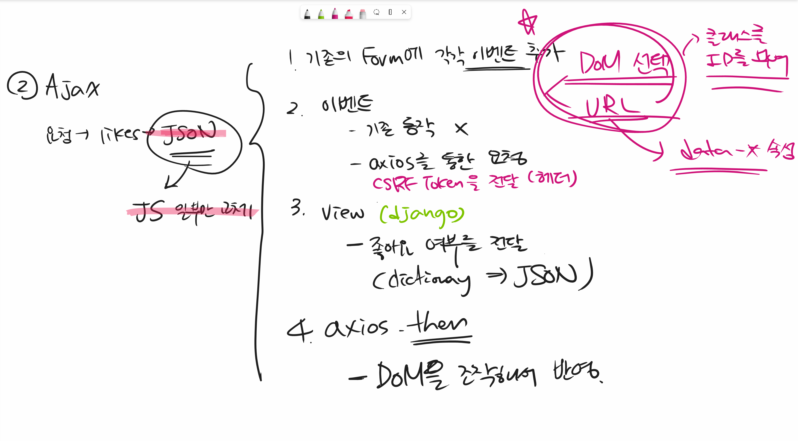
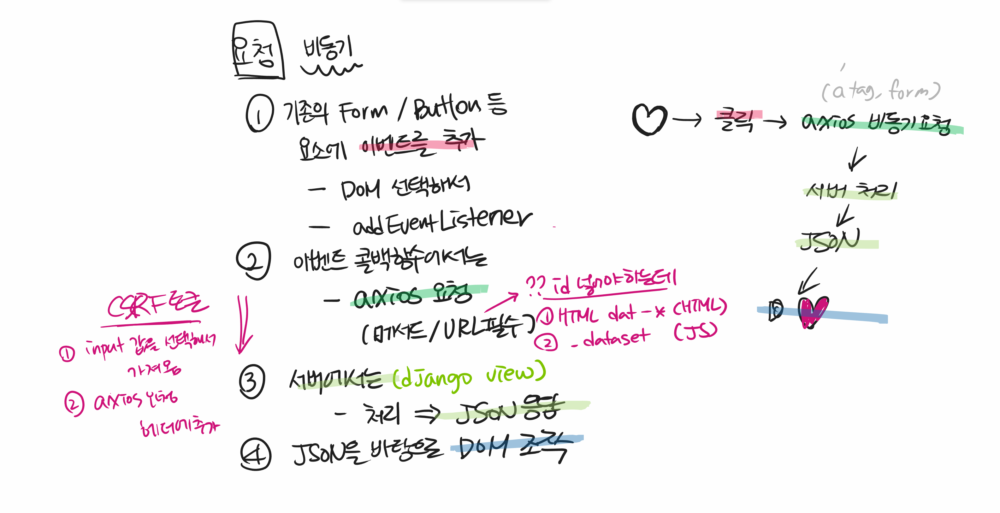
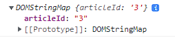
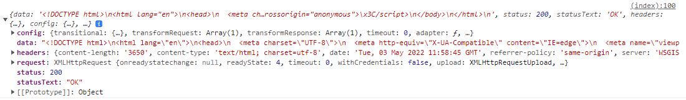
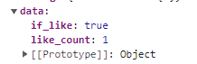
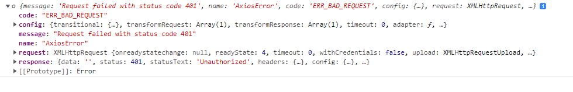

# 좋아요 => 비동기

> .then() 은 status 가 200일때만!!!
>
> .catch() 는 status가 200 이외의 모든 것일때







## 1. index.html => 기존 form을 변경

```django
  
<script>
    const likeForm = document.querySelectorAll('.likeForm')
    likeForm.forEach(element => {
        element.addEventListener('submit', function (event){
            event.preventDefault()
            console.log(event.target.dataset)
            const URL = `/articles/${event.target.dataset.articleId}/likes/`
            const csrftoken = document.querySelector('[name=csrfmiddlewaretoken]').value
            axios.post(URL, {}, {
                headers :{'X-CSRFT-Token' : csrftoken}
            })
                .then(response => console.log(response))
        })
    })

</script>

```

```
index.html 에서 article들을 모두 출력하기 때문에 class로 지정하고 querySelectorAll로 받아옴
=> forEach로 모두 돌아줘야 함.
```


### dataset

```django
<form class="likeForm asdfasdf" data-article-id={{ article.pk }} action="" method="POST">  
    
    
    <input type="submit" value="좋아요 취소">
    
    <input type="submit" value="좋아요">
    
</form>
```

```
=>  data-* 를 넣어주게 되면 속성에 dataset이 생김
console.log(event.target.dataset) => article-id로 했기 때문에 articleId로 생김
=> 이걸로 URL 넣기
```




### 

```
html에  넣어주면 
=> <input type="hidden" name="csrfmiddlewaretoken" value="YrBQxfk6cyAlKqAigDhXJkHaMiwaqvnDktDq2lqP4b1vUcKjdo8tXoKrjBlnt5NG"> 가 랜더링될 때 생성됨
```

```javascript
const csrftoken = document.querySelector('[name=csrfmiddlewaretoken]').value // csrf토큰에 접근
// => axios로 요청 보낼 때 토큼이 필요하면 headers 부분 변경 필요

//1  2번째 인자가 data이기 때문에 2번째 비워둠
axios.post(URL, {}, {
                headers :{'X-CSRFT-Token' : csrftoken}
            })
	.then()


//2
axios({
      method : 'post',
      url : URL,
      headers : {
        'X-CSRFToken' : token
      }
    })
      .then() 
```


## 2. views.py 변경

```javascript
axios({
      method : 'post',
      url : URL,
      headers : {
        'X-CSRFToken' : token
      }
    })
      .then( res => console.log(res)) 
```



```
views.py 에서 return redirect로 html파일로 보내고 있기 때문에 html문서가 넘어옴
=> return 값으로 json 을 받아와야 하기 때문에 views.py 변경 필요
```


```python
# articles/views.py

from django.http import JsonResponse

@require_POST
def likes(request, article_pk):
    if request.user.is_authenticated:
        article = get_object_or_404(Article, pk=article_pk)

        # 이 게시글에 좋아요를 누른 유저 목록에 현재 요청하는 유저가 있다면.. 좋아요 취소
        # if request.user in article.like_users.all(): 
        if article.like_users.filter(pk=request.user.pk).exists():
            article.like_users.remove(request.user)
            if_like = False
        else:
            article.like_users.add(request.user)
            if_like = True
        context = {								//JsonResponse에 넣어주기 위해 context 딕셔너리 생성
            'if_like' : if_like,
            'like_count' : article.like_users.count()
        }
        return JsonResponse(context)
    return redirect('accounts:login')
```

변경 후 json으로 넘어옴 




### JsonResponse

> https://docs.djangoproject.com/en/3.2/ref/request-response/
>
> HttpResponse 의 subclass
>
> The first parameter, `data`, should be a `dict` instance. If the `safe` parameter is set to `False` (see below) it can be any JSON-serializable object.
>
> safe인자가(default=True) 가 False이면 딕셔너리가 아니어도 됨. default는 딕셔너리 


## 3. axios.then()

```javascript
axios({
      method : 'post',
      url : URL,
      headers : {
        'X-CSRFToken' : token
      }
    })
      .then( res => {
        const buttonLike = document.querySelector(`#buttonLike-${ event.target.dataset.articleId }`)
        buttonLike.value = res.data.if_like ? '좋아요 취소':'좋아요'
        const likeCount = document.querySelector(`#like-count-${ event.target.dataset.articleId }`)
        likeCount.innerText = res.data.like_count

      })
```


## 4. 비로그인 이라면??? => .catch()

> django는 결국 요청에 따른 응답만 넘겨주면됨  => XMLHttpRequest or HttpRequest
>
> render, redirect가 필요가 없음
>
> 새로운 url로 보내주는 것도 JS가

```python
# articles/views.py

from django.http import HttpResponse, JsonResponse

@require_POST
def likes(request, article_pk):
    if request.user.is_authenticated:
        article = get_object_or_404(Article, pk=article_pk)

        # 이 게시글에 좋아요를 누른 유저 목록에 현재 요청하는 유저가 있다면.. 좋아요 취소
        # if request.user in article.like_users.all(): 
        if article.like_users.filter(pk=request.user.pk).exists():
            article.like_users.remove(request.user)
            if_like = False
            
        else:
            article.like_users.add(request.user)
            if_like = True
        context = {
            'if_like' : if_like,
            'like_count' : article.like_users.count()
        }
        return JsonResponse(context)
    return HttpResponse(status=401) / => 비로그인시 401 반환
```


* .catch() 부분으로

```javascript
console.log(error)
```




```javascript
.catch( error => {
    if (error.response.status === 401) {
        window.location.href = '/accounts/login/'
    } else {
        console.log(error)
    }
})
```

```
Browser 조작으로 새로운 경로로 redirect 해줌.
```


