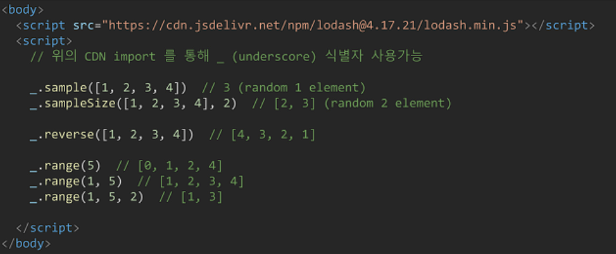

# JavaScript

> 브라우저를 조작할 수 있는 유일한 언어
>
> 브라우저 화면을 '동적'으로


## 브라우저 (browser)

> HTML 문서, 그림, 멀티미디어 파일 등 다양한 인터넷 컨텐츠를 검색 및 열람하기 위한 프로그램

> URL 로 웹(WWW)을 탐색, 서버와 통신, HTML문서나 파일을 출력하는 GUI 기반의 소프트웨어

> Google Chrome, Mozilla Firefox, Microsoft Edge, Safri, Opera


### DOM 조작(Document Object Model) - 문서조작

> HTML, XML 과 같은 문서를 다루기 위한 프로그래밍 인터페이스


* 파싱(해석)
  * 구문 분석, 해석
  * 브라우저가 문자열을 해석해 DOM Tree로 만드는 과정
* 조작
  * 구문 변경
  * ex) title 변경 


### BOM(Browser Object Model)

> 자바스크립트가 브라우저와 소통하기 위한 모델


### Java Script Core(ECMAScript)

> 브라우저(DOM&BOM)을 조작하기 위한 명령어 약속


## 변수와 식별자 

### 식별자

> 자바스크립트 이름 명명할때 사용하는 단어
>
> 변수명, 함수명, 속성명, 메소드명

* 식별자는 반드시 문자, 달러($), 밑줄(_)로 시작

  * ```js
    identifier
    identifier10
    _identifier
    $identifier
    Identifier
    ```

* 키워드 x, 숫자 시작 x, 공백 x

  * ```
    break
    123identifier
    has space
    ```

* 대소문자 구분
* 클래스명 외에는 모두 소문자


### camelCase

* 변수, 객체, 함수

* ```javascript
  //변수
  let dog
  let variableName
  //객체
  const userInfo = {name:'TOM'}
  //함수
  function add() {}
  function getName() {}
  ```

  

### PascalCase

* 클래스, 생성자

* ```javascript
  //클래스
  class User {	
  }
  //생성자
  function User(){
      
  }
  ```

  

### SNAKE_CASE

* 상수(const)

* ```javascript
  //상수
  const PI = Math.PI
  const API_KEY = 'my-key'
  ```

  

### let vs const vs var

| 키워드 | 재선언 | 재할당 | 스코프      | 비고            |
| ------ | ------ | ------ | ----------- | --------------- |
| let    | X      | O      | 블록 스코프 | ES6             |
| const  | X      | X      | 블록 스코프 | ES6             |
| var    | O      | O      | 함수 스코프 | 사용하지 말 것. |


|        |                 |             |
| ------ | --------------- | ----------- |
| 선언   | 변수 생성       | let foo     |
| 할당   | 변수에 값 저장  | foo = 11    |
| 초기화 | (선언) + 재할당 | let bar = 0 |


### 블록 스코프

> if, for 등의 중괄호 내부
>
> 블록 스코프를 가지는 변수는 블록 바깥에서 접근 불가능

```javascript
let x = 1
if (x === 1) {
    let x = 2
    console.log(x) // 2
}
console.loge(x) // 1
```


### 함수스코프

> 함수 내부
>
> 함수에서 선언한 변수들은 해당 함수 내에서만 접근 가능 


### var

> 재선언 및 재할당 모두 가능 
>
> 함수 스코프

**호이스팅* 특성으로 사용 하지말자**

* 호이스팅
  * 변수를 선언 이전에 참조 가능
  * 변수 선언 이전의 위치에서 접근시 undefined => 에러가 아님 


## 데이터 타입


### 원시 타입(Primitve type)

* 객체가 아닌 기본 타입
* 변수에 해당 타입의 '값'이 담김
* 다른 변수에 복사할 때 **실제 값**이 복사됨

```javascript
let message = '안녕'

let greeting = message
console.log(greeting)  // '안녕'

message = 'hello'
console.log(greeting) //'안녕'
```

* 숫자타입 (Infinity, -Infinity, -0, NaN)
* 문자열타입
* undefined
* null
* Bollean


### undefined vs null

* undefined
  * 빈 값 표현
  * 개발자의 의도가 아니라, 자동으로 할당
  * typeof 결과 undefined
* null
  * 빈 값 표현
  * 개발자가 의도적으로 할당
  * typeof 결과 object 


### 참조 타입(Reference type)

* 객체타입의 자료형
* 변수에 해당 객체의 **참조 값**이 담김
* 다른 변수에 복사할 때 **참조 값**이 복사됨

```javascript
const message = ['안녕']

const greeting = message
console.log(greeting)  // '안녕'

message[0] = 'hello'
console.log(greeting) //'hello'
```

* 함수, 배열, 객체(dict 개념)


## 연산자

* ++, -- 존재

### 동등 비교 연산자(==) vs 일치 비교 연산자(===)

```javascript
const a = 1004
const b = '1004'
console.log(a === b)  // false => 암묵적 타입 변환

console.log(a == b)  // True => 엄격한 비교 

// 다르다  !== 로 표현
a !== b           // true 
```


* 논리 연산자
  * &&
  * ||
  * !

```java
// 단축평가
console.log(1 && 2 && 3 && 4 )   // 4

console.log(1 || 2 || 3 || 4 )   // 1
```


* 삼항 연산자

```javascript
console.log(true ? 1:2 )  //1
console.log(false ? 1:2 )  // 2
//=> ? 앞이 참이면 : 앞  ? 앞이 거짓이면 : 뒤를 출력 
```

```python
1 if True else 0  # 파이썬 이것과 비슷 
```


## 조건문

| 데이터 타입 | 거짓       | 참               |
| ----------- | ---------- | ---------------- |
| Undefined   | 항상 거짓  | x                |
| Null        | 항상 거짓  | x                |
| Number      | 0, -0, NaN | 나머지 모든 경우 |
| String      | 빈 문자열  | 나머지 모든 경우 |
| Object      | x          | 항상 참          |

=> **if [] 도 참!!!!!**


### if statement

```javascript
if (condition) {
    // do something
} else if (condition) {
    // do something
} else {
    // do something
}
```


### switch statement

```javascript
const nation = 'Korea'

switch(nation) {
    case 'Korea':{
        console.log('안녕')
        break
    }
    case 'France':{
        console.log('봉주르')
        break
    }
    default :{
        console.log('hello')
        
    }
}
```


## 반복문


### while

```javascript
let i = 0
while (i<6) {
    console.log(i)
    i += 1
}    // 0, 1, 2, 3, 4, 5
```


### for

```javascript
for (let i = 0; i<6;i++) {
    console.log(i)
}   // 0, 1, 2, 3, 4, 5
```


### for  in 

> 객체의 속성(key)들을 순회할 때 사용
>
> 배열은 순회 가능하지만 하지말자! => 키 접근이기 때문에 인덱스가 나옴 + str 취급

```javascript
const capitals = {
    korea:'seoul',
    france:'paris'
}

for (let capital in capitals) {
    console.log(capital)
}    // korea, france
```


### for of

> 반복 가능한 객체를 순회하며 값을 꺼냄 => dict 불가능

```javascript
const fruits = ['딸기', '바나나']

for (let fruit of fruits) {
    fruit = fruit + '!'
    console.log(fruit)
}   // 딸기!, 바나나!
```


## 함수

> JavaScript의 함수는 일급 객체!!

### 일급 객체

* 변수에 할당 가능
* 함수의 매개변수로 전달 가능 (콜백)
* 함수의 반환 값으로 사용 가능
* 파이썬의 데코레이터


### 기본 인자

* 인자 안에 = 으로 default 값 지정 가능 

```javascript
const greeting = function (name='YK') {
    return `Hi ${name}`
}
greeting()  //Hi YK
```


### ### 문자열 안에 변수 넣고 싶으면 ''  가 아니라 ``로 해야함 ###


### 매개변수와 인자 개수 불일치

* 매개변수 < 인자의 개수

```javascript
const threeArgs = function(arg1, arg2, arg3) {
    return [arg1, arg2, arg3]
}
threeArgs()      //[undefined, undefined, undefined]
threeArgs(1)	 //[1, undefined, undefined]
threeArgs(1,2)	 //[1, 2, undefined]
```

* 매개변수 > 인자의 개수

```javascript
const noArgs = function() {
    return 0
}
noArgs(1,2,3)   // 0

const twoArgs = function (arg1, arg2) {
    return [arg1, arg2]
}
twoArgs(1,2,3)   //[1, 2]
```


### Operator

* Rest operator (python의 *arg) => 묶어주는 애 (pack)

```javascript
const restOpr = function (arg1, arg2, ...restArgs) {
    return [arg1, arg2, restArgs]
}
restOpr(1,2,3,4,5) // [1,2, Array(3)] => 자세히보기 하면 array 볼 수 있음.
            
```

* Spread operator => unpack

``` javascript
const spreadOpr = function (arg1, arg2, arg3) {
    return arg1 + arg2 + arg3
}
const numbers = [1,2,3]
spreadOpr(...number)  // 6  => 리스트 안의 값 3개를 풀어서 넣어줌
```


### 함수 선언식 (declaration)

> 함수의 이름과 함께 정의 하는 방식


```javascript
add(2, 7)   //9  => 호이스팅 가능(호출 이후 선언 가능)

function add (num1, num2) {
    return num1 + num2
}
add(3, 4)  //7
```


### 함수 표현식 (function expression)

> 함수를 표현식*내에서 정의하는 방식
>
> 표현식 : 어떤 하나의 값으로 결정되는 코드의 단위 

* 익명함수로 표현 가능 : 이름이 없는 함수 

```javascript
add(2, 7)  // Uncaught ReferenceError => 선언 후 호출해야함. 호이스팅 x

const add = function (num1, num2) {
    return num1 + num2
}
add(3, 4)    //7 
```


### Arror Function

> 함수를 비교적 간결하게 정의할 수 있는 문법

> fucntion 키워드 생략 가능

```javascript
const arrow = function(name) {
    return `hello, ${name}`
}
// function 키워드 삭제
const arrow = (name) => {return `hello, ${name}`}
// 매개변수 1개일 때 () 삭제
const arrow = name => {return `hello, ${name}`}
// 바디부분 return 포함한 표현식 1개일 경우 {} & return 삭제 가능 
const arrow = name => return `hello, ${name}`

```


## 문자열


### string.includes(value)

* string에 value가 존재하는지 판별 후 참 또는 거짓 반환

```javascript
const str = 'a santa at nasa'

str.includes('santa')   // true
str.includes('asan')    // false
```


### string.split(value)

* value가 없을 경우, 기존 문자열을 배열에 담아 반환
* value가 빈 문자열일 경우 각 문자로 나눈 배열을 반환
* value가 기타 문자열일 경우, 해당 문자열로 나눈 배열을 반환

```javascript
const str = 'a cup'

str.split()   // ['a cup']
str.split('') // ['a','','c','u','p']
str.split(' ')// ['a', 'cup']
```


### string.replace(from, to)   string.replaceAll(form, to)

* replace : string에 from 값이 존재할 경우, 1개만 to로
* replaceAll : string에 from 모든 값을 to로 교체하여 반환

```javascript
const str = 'a b c d'

str.replace(' ', '-')		// 'a-b c d'
str.replaceAll(' ', '-')	// 'a-b-c-d'
```


### string.trim() , string.trimStart()  , string.trimEnd()

* 시작과 끝의 모든 공백 제가,  문자열 시작 앞부분 공백 제거,  문자열 뒷부분 공백 제거

```javascript
const str = '       he   llo       '

str.trim()				// 'he   llo'
str.trimStart()			// 'he   llo       '
str.trimEnd()			// '       he   llo'
```


## 배열(Arrays)

> 모양은 리스트 , 배열 이지만 타입은 객체(object)

* -index 접근 불가
* 키(인덱스), 속성(값) => 객체


| 메서드          | 설명                                      | 비고                     |
| --------------- | ----------------------------------------- | ------------------------ |
| reverse         | 배열 요소 순서 반대로 정렬                |                          |
| push & pop      | 배열 **가장 뒤**에 요소 추가 또는 제거    |                          |
| unshift & shift | 배열 **가장 앞**에 요소 추가 또는 제거    |                          |
| includes        | 배열의 특정 값 존재하는지 판별            |                          |
| indexOf         | 특정 값 존재 판별 후 인덱스 반환          | 요소 없으면 -1 반환      |
| join            | 배열의 모든 요소를 구분자를 이용하여 연결 | 구분자 생략 시 쉼표 기준 |


### 콜백 메서드

| 메서드  | 설명                                                         | 비고         |
| ------- | ------------------------------------------------------------ | ------------ |
| forEach | 배열의 각 요소에 대해 콜백 함수 한번씩 실행                  | 반환 값 없음 |
| map     | 콜백 함수의 반환 값을 요소로 **새로운 배열** 반환            |              |
| filter  | 콜백 함수의 반환 값이 참인 요소들만 모아 **새로운 배열** 반환 |              |
| reduce  | 콜백 함수의 반환 값들을 하나의 **값(acc)에 누적** 후 반환    | 인자 2개     |
| find    | 콜백 함수의 반환 값이 참이면 해당 요소 반환                  |              |
| some    | 배열의 **요소 중 하나라도** 판별 함수를 통과하면 참을 반환   |              |
| every   | 배열의 **모든 요소**가 판별 함수를 통과하면 참을 반환        |              |


## 객체 (Object)

> 객체는 속성의 집합이며, 중괄호 내부에 key 와 value의 쌍으로 표현한다.

* key 는 문자열 타입만 가능 => key이름에 띄어쓰기 등의 구분자 있으면 따옴표로 묶어서 표현
* value는 모든 타입(함수 포함) 가능 => 함수면 메서드
* 객체 요소 접근은 점 또는 대괄호로 가능 => key이름에 띄어쓰기 같은 구분자 있으면 대괄호접근만 가능

* 메서드 내부에서 this 키워드는 객체를 의미함

```javascript
const me = {
    firstName : 'John',
    lastName : 'Doe',
    fullName : this.firstName + this.lastName
    getFullName : function () {
        return this.firstName + this.lastName
    }
	'samsung products' : {
        buds : 'Galaxy Buds',
        galaxy : 'Galaxy s8'
    }
}
console.log(me['samsung products'].buds) => 대괄호로만 접근 가능
fullName 은 함수가 아니므로 정상출력 되지 않음  => NaN

```


### 속성명 축약

> 객체 정의할 때 key와 할당되는 변수의 이름이 같으면 축약 가능

```javascript
const books = ['JS', 'PYTHON']
const magazines = ['Vogue', 'Science']

const bookShop = {
    books,
    magazines
}
```


### 메서드명 축약

> 메서드 선언 시 function 키워드 생략 가능

```javascript
const obj = {
    greeting() {
        console.log('Hi')
    }
}
obj.greeting()  // Hi
```


### 계산된 속성

> 객체를 정의할 때 key 의 이름을 표현식을 이용하여 동적으로 생성 가능

```javascript
const key = 'regions'
const value = ['광주', '서울', '부산']

const ssafy = {
    [key] : value,
}
console.log(ssafy)		   // {regions: Array(3)}
console.log(ssafy.regions) // ['광주', '서울', '부산']
```


### 구조 분해 할당

> 배열 또는 객체를 분해하여 속성을 변수에 쉽게 할당할 수 있는 문법

```javascript
const userInfor = {
    name : 'ssafy Kim',
    userId : 'ssafyStudent',
    phoneNumber : '010-1234-1234'
}

const {name} = userInfor
const {userId} = userInfor
const {name, phoneNumber} = userInfor


function printUser({ name, userId, phoneNumber } = userInfor) {
	console.log(name, userId, phoneNumber)
}


```


### JSON

> JavaScript Object Notation

* key-value 쌍의 형태로 데이터를 표기하는 표준 포맷
* 자바스크립트의 객체와 유사하게 생겼으나 실제는 문자열 타입
* => 문자열 타입이기 때문에 JS 객체로써 조작하기 위해 구문분석(Parsing) 필수

* JSON.parse()
  * JSON => 자바스크립트 객체
* JSON.stringify()
  * 자바스크립트 객체 => JSON


## this

> 실행 문맥에 따라 다른 대상을 가리킴
>
> 파이썬의 self 와 비슷
>
> 객체.메서드명()으로 호출 가능 => this는 해당 메서드가 소속된 객체를 가리킴
>
> 최상위 객체는 window  => 메서드가 아닌 곳에서 this 는 window

```javascript
const obj = {
    PI : 3.14,
    radiuses : [1,2,3,4,5],
    printArea : function () {
        this.radiuses.forEach(function (r){
            console.log(this.PI*r*r)
        }.bind(this))
    },
}
```

```
this.radiuses.forEach 는 객체.객체.메서드 이므로 정상 접근가능
forEach 안에 콜백 함수는 this 정상 접근 불가능  => window로 잡힘
그래서 bind(this)
```

* 화살표 함수

```javascript
const obj = {
    PI : 3.14,
    radiuses : [1,2,3,4,5],
    printArea : function () {
        this.radiuses.forEach( r => console.log(this.PI * r * r)
        )
    }
}
```


## lodash

> 모듈성, 성능 및 추가 기능을 제공하는 JavaScript 유틸리티 라이브러리



```
script 안에 부트스트랩처럼 넣어주고 사용 가능
```


## 정규 표현식


## History


### 크로스 브라우징 (Cross Browsing)

> 브라우저마다 각기 다른 자체 자바스크립트 언어를 사용하게 됨.
>
> 브라우저마다 다른 방식의 언어, 코딩이 필요해지면서 웹 표준 필요성 제기


### ECMA 탄생


