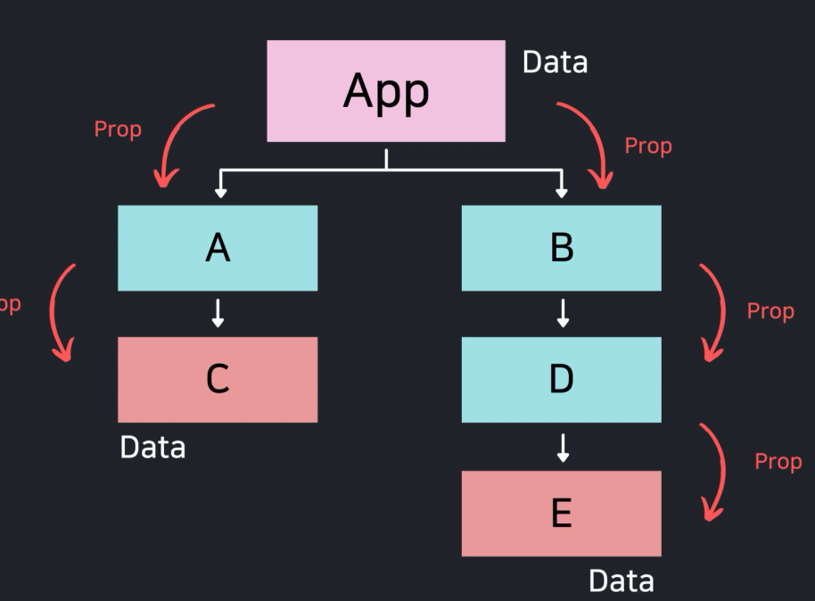
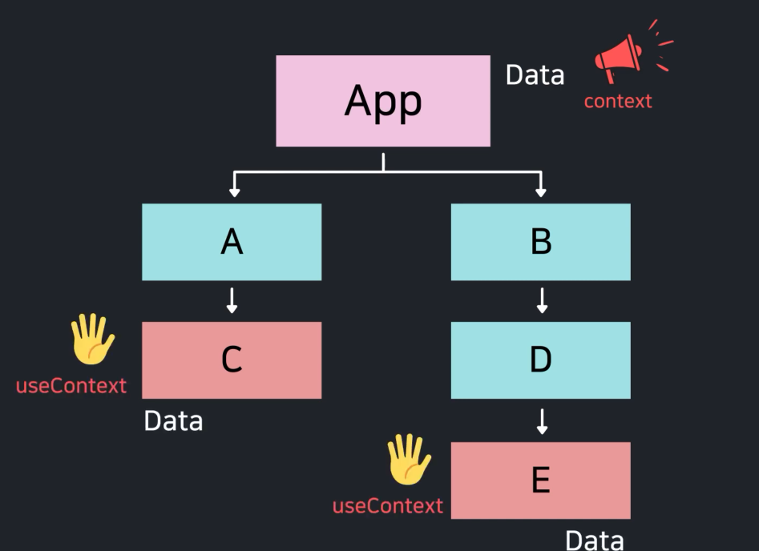

# React Hooks

* useState

> state가 변경될때마다 컴포넌트가 계속 렌더링됨 => 초기값을 가져오는 부분도 계속 반복됨

```react
const [state, setState] = useState(초기값);

// setState 함수는 값만 지정해주는 것보다 콜백 함수를 지정하는 것이 좋다.

setState((prevState) => {
	return [input, ...prevState];
});

// 초기값을 가져오는 작업을 한번만 하려면 useState(콜백함수) 형식으로
const [state, setState] = useState(() => {
    return heavyWork();
});
```


* useEffect

> mount (첫 렌더링), update(리 렌더링), unmount (화면에서 사라질 때) 특정 작업을 처리하려면 useEffect를 사용
>
> 콜백함수를 넣어줌

```react
// 렌더링 될때마다 매번 실행됨
useEffect(() => {
    console.log('렌더링');
});

// mount + count가 변경될때만 실행됨
useEffect(() => {
    console.log('count 변화');
}, [count]);

// mount 될때만 실행됨(한번)
useEffect(() => {
    console.log('count 변화');
}, []);

// return 부분은 unmount 될때 실행됨
useEffect(() => {
	const timer = setInterval(() => {
        console.log('타이머 돌아가는중...');
    }, 1000);
    
    return () => {
        clearInterval(timer);
        console.log('타이머 종료');
    };
}, [])

```


* useRef

> ref object 반환 { current: value }
>
> 컴포넌트가 렌더링되는 동안 계속 유지
>
> 1. state와 다르게 렌더링이 다시되지않음. 
> 2. state의 변경으로 리렌더링이 되도 값이 변경되지 않음.
> 3. dom 요소에 접근이 가능하다


* useContext

> context 는 전역변수를 조금더 쉽게 활용하기 위해서 사용함

* props 만 사용한다면 



* context를 사용했을 때




```react
export default function App() {
    const [isDark, setIsDark] = useState(false);
    
    return <Page isDark={isDark} setIsDark={setIsDark} />;
}

export default Page({isDark, setIsDark}) {
    return (
        <div className="page">
            <Header isDark={isDark}></Header>
            <Content isDark={isDark}></Content>
            <Footer isDark={isDark} setIsDark={setIsDark}></Footer>
        </div>
    )
}


// context 사용
export default function App() {
    const [isDark, setIsDark] = useState(false);
    
    return (
        <ThemeContext.Provider value={{ isDark, setIsDark }}>
            <Page/>;
        </ThemeContext.Provider>
}

export default Page() {
    return (
        <Header ></Header>
        <Content ></Content>
        <Footer ></Footer>  
    )
}

export default Header () {
    const { isDark } = useContext(ThemeContext);
    
    return(
    	<header>
            <h1>하이</h1>
        </header>
    )
}
```


* useMemo

> component 최적화를 위해 (성능 향상)
>
> useEffect와 실행 시기는 같지만 새 값을 메모이제이션한다.
>
> 메모이제이션된 **'값'** 반환

 

* useCallback

> 콜백함수, 의존성 배열을 인자로 받음
>
> **함수이름이 같다고 같은함수가 아님!** => 함수 저장한 위치변경이 없어야함
>
> 메모이제이션된 **'함수'** 반환


* useReducer

> 일반적으로 state(상태)가 previous state(이전 상태)에 크게 의존하거나 state(상태)가 매우 복잡한 경우 useReducer를 사용하는 것이 좋음


## Custom Hooks

> 함수를 하나 만드는 것과 같다.


