# Vue 02


## SFC(Single File Component)

* 컴포넌트를 구성하는 것은 결국 HTML/CSS/JS 
  * `.vue`  컴포넌트 단위로 코드를 관리하자!


### Component(컴포넌트)

> 컴포넌트 == (기계 부품)  ==> 기계 부품들을 모아 하나의 기계를 동작하는 형태
>
> 단일 파일은 코드의 양이 많아지면 변수 관리 힘듦, 유지보수 힘듦

* 유지보수 높임, 재사용성 증가

* **Vue 컴포넌트 === Vue 인스턴스 === .vue 파일**

* 한 화면에서도 기능 별로 각기 다른 컴포넌트 존재 => Vue 가 개발 환경 제공


## Vue CLI

> Vue.js 개발을 위한 표준 도구
>
> 확장 플러그인, GUI, Babel 등 다양한 tool 제공


### Node.js

> JS를 브라우저가 아닌 환경에서도 구동할 수 있도록 하는 자바스크립트 런타임 환경
>
> Chrome V8 엔진을 제공
>
> https://nodejs.org/ko/ 

* 그동안 JS로 결과물을 보기 위해서는 항상 브라우저를 이용했지만
* node.js를 이용하면 로컬 pc에서 실행 가능


### NPM(Node Package Manage)

> JS를 위한 패키지 관리자

* python 에는 pip, node.js 에는 npm


## Babel & Webpack

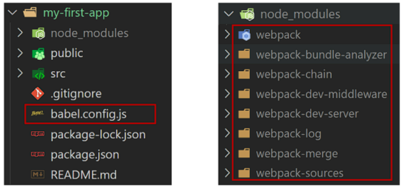


### Babel

> JavaScript compiler
>
> 자바스크립트는 인터프리터 언어이지만, 컴파일러가 존재

* JS의 ECMAScript 2015+ 코드를 이전 버전으로 번역/변환해 주는 도구
* 과거 JS의 파편화와 표준화의 영향으로 코드의 스펙트럼이 다양


### Webpack

> static module bundler

* 모듈 간의 의존성 문제를 해결하기 위한 도구(Bundler)중 하나

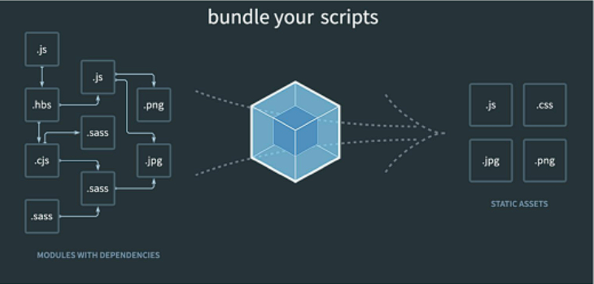


## Vue 프로젝트 구조

> .vue는 .py 와 같이 실제 존재하는 파일 형식이 아님 

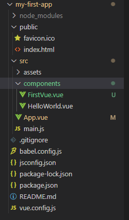


### node_modules

* node.js 환경의 여러 의존성 모듈
* 용량 매우 큼 (100메가)


### public/index.html

* Vue 앱의 뼈대가 되는 파일 
* 실제 제공되는 단일 html 파일


### src/assets

* webpack에 의해 빌드 된 정적 파일


### src/components

* 하위 컴포넌트들이 위치


### src/App.vue

* 최상위 컴포넌트


### src/main.js

* 빌드 시작시 가장 먼저 실행되는 곳
* Vue 전역에서 활용 할 모듈을 등록 
* settings.py 같은 느낌


### babel.config.js

* babel 관련 설정 파일


### package.json

* 프로젝트 종속성 목록과 지원되는 브라우저에 대한 구성 옵션
* requirements.txt 같은 느낌 


### package-lock.json

* 모듈과 관련된 모든 의존성을 설정 및 관리


## Vue CLI 시작

### 설치

> `-g`는 전역 설치를 의미
>
> node  기본설정이 가상환경  => -g 로 전역에 설치   => -g 는 문서에서 하라는 곳에만 하자!
>
> python은 venv 없이 인스톨시 global 설치

```bash
$ npm install -g @vue/cli

$ vue --version
```


### 프로젝트 생성

```bash
$ vue create my-vue
```

* Vue 버전 선택

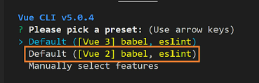


### npm run serve

> vue 개발 서버 실행

```bash
$ npm run serve
```

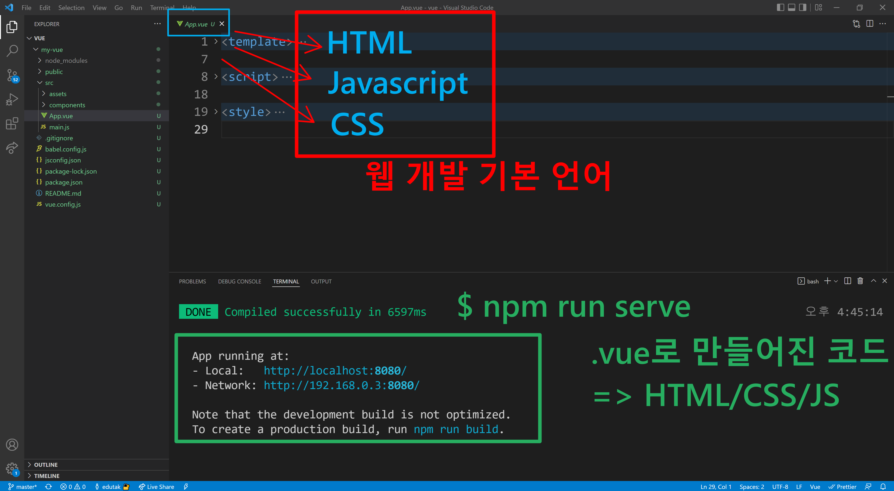


## 컴포넌트 

### 컴포넌트 생성

`.vue` 파일들은 모두 각각의 컴포넌트이다.

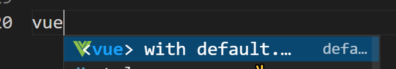

```vue
<template>
</template>

<script>
export default {
    
}
</script>

<style>
</style>
```

* template은 반드시 하나의 루트 요소로 구성이 되어야 한다.
  *  Component template should contain exactly one root element. If you are using v-if on multiple elements, use v-else-if to chain them instead.
* script

### 컴포넌트 활용

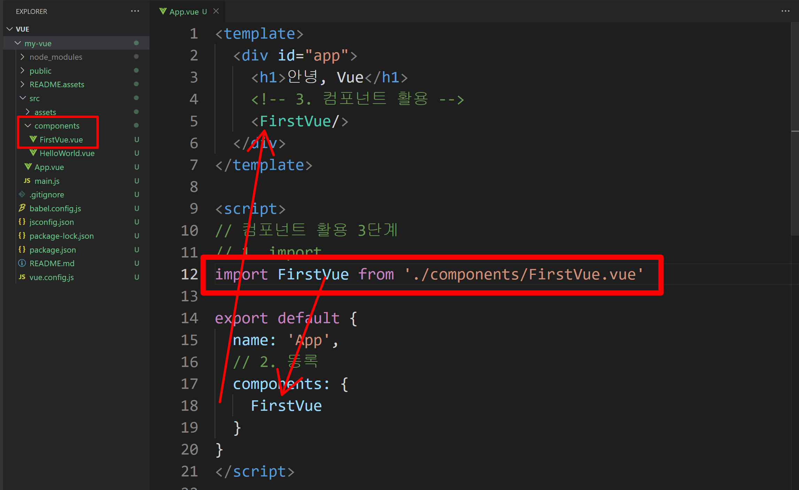

1. import를 한다.

   ```javascript
   // 1. import
   import FirstVue from './components/FirstVue.vue'
   ```

2. 컴포넌트에 등록한다.

   ```javascript
   export default {
     name: 'App',
     // 2. 등록
     components: {
       FirstVue
     }
   }
   ```

3. 활용한다. => 방법 3개

   ```vue
   <template>
     <div id="app">
       <h1>안녕, Vue</h1>
       <!-- 3. 컴포넌트 활용 -->
       <FirstVue/>
         
       <firstVue></firstVue>
         
       <first-vue></first-vue>
         
     </div>
   </template>
   ```

### props

> 부모가 준 데이터

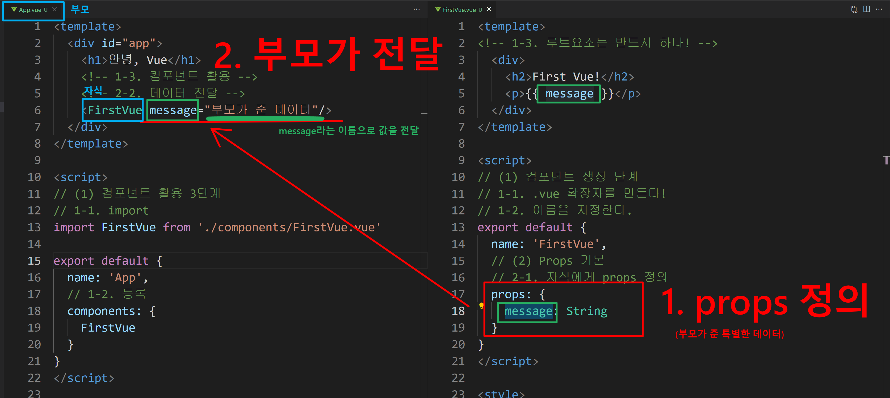

### emit

> 자식이 부모에게 이벤트를 만들어서 전달
>
> 부모는 이벤트를 받는다!

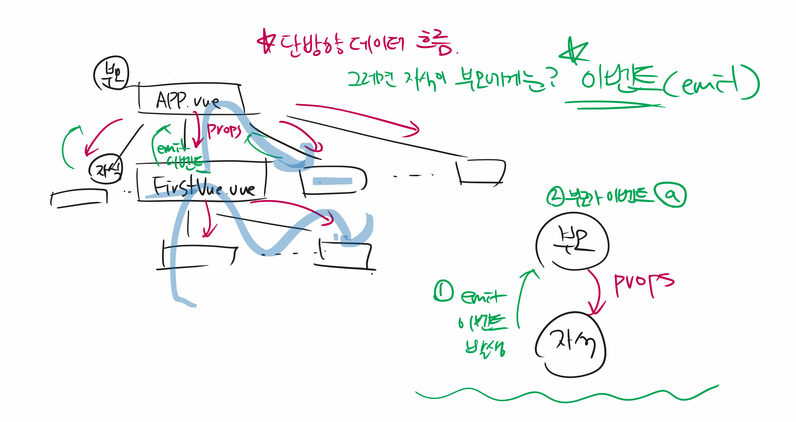

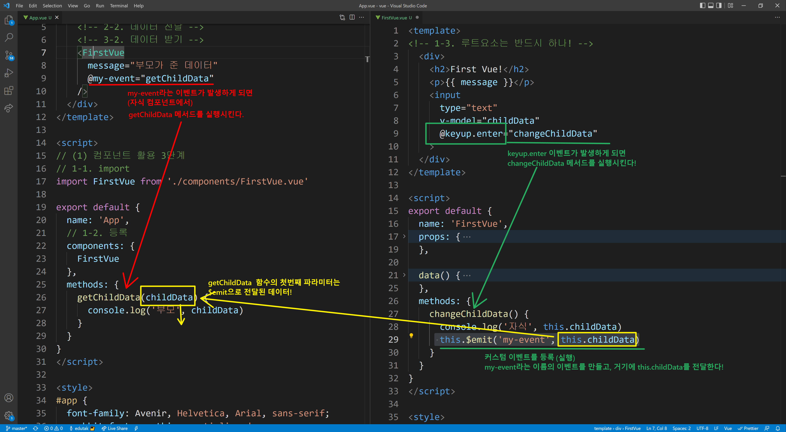

* keyup.enter 이벤트가 발생하면 changeChildData 메서드 실행
* 이 메서드 내부에서 my-event 이벤트를 $emit 하게되고
* 부모 컴포넌트에서 자식컴포넌트의 이벤트를 @my-event하고 있으니 getChildData 메서드가 실행되고
* getChildData 메서드에서는 부모가 데이터를 받아서 할 일을 정의한다!


## Vue Router

> SPA 등장이전에는 모든 요청 경로를 서버가 통제(서버가 라우팅)
>
> SPA 등장이후 하나의 index.html만 제공 => CSR, 즉 라우팅에 대한 결정권을 클라이언트쪽으로


### Vue Router 시작하기

```bash
$ vue add router
```

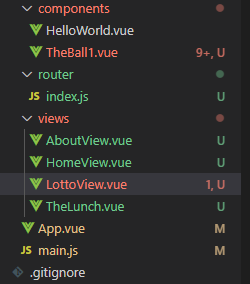


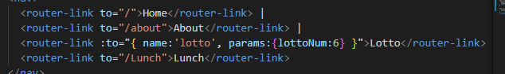


### index.js

* 라우트에 관련된 정보 및 설정이 작성되는 곳 

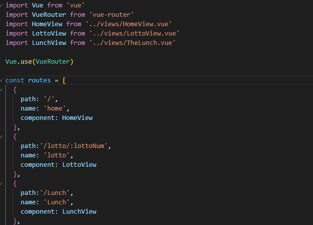


### router-link

* 사용자 네비게이션을 가능하게 하는 컴포넌트

* 기존 a태그에서 기본이벤트를 제거한 형태


### router-view

* 주어진 라우트에 대해 일치하는 컴포넌트를 렌더링하는 컴포넌트
* 실제 componen가 DOM에 부착되어 보이는 자리를 의미


### Named Routes

* 이름을 가지는 라우트 (장고의 url naming과 비슷)

```vue
<router-link :to={ name:'home '}>Home</router-link>
```


### 프로그래밍 방식

> router-link 사용하지 않고 router의 인스턴스 메서드를 사용하는 방식
>
> $router.push(...)

| 선언적 방식             | 프로그래밍 방식   |
| ----------------------- | ----------------- |
| \<router-link to="..."> | $router.push(...) |


### Dynamic Route Matching

* 동적 인자 전달 => 동적인자는 :으로 전달

| pattern                            | matched path          | $route.params                           |
| ---------------------------------- | --------------------- | --------------------------------------- |
| /user/:userName                    | /user/john            | { username: 'john'}                     |
| /user/:userName/article/:articleId | /user/john/article/12 | { username: 'john',<br />articleId: 12} |


## Components vs views

* App.vue
  * 최상위 컴포넌트
* views/
  * router(index.js)에 매핑되는 컴포넌트를 모아두는 폴더
* components/
  * router에 매핑된 컴포넌트 내부에 작성하는 컴포넌트를 모아두는 폴더


### Environment Variable

> API 키 환경변수 설정하기 => git에 push할 때 대비 (django의 secret key 같은 느낌)

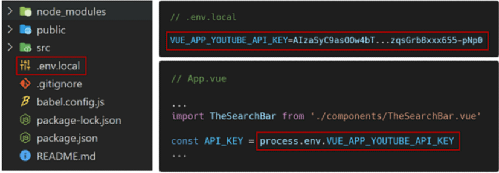

* 프로젝트 최상단에 .env.local 배치
* 변수 명은 'NODE_ENV', 'BASE_URL', 'VUE_APP_'으로 시작해야 함.
