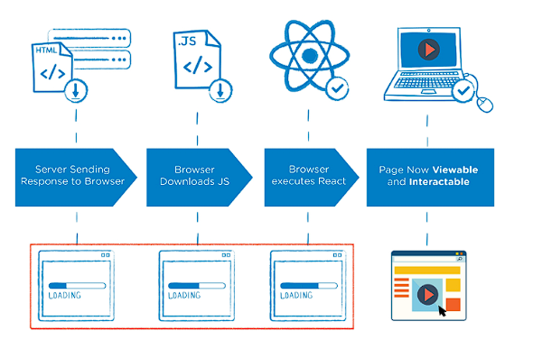

# Vue.js

> 사용자 인터페이스를 만들기 위한 진보적인 자바스크립트 프레임워크
>
> SPA(Single Page Application)을 완벽하게 지원


## SPA vs MPA

### SPA

> Single Pag Application
>
> 현재 페이지를 동적으로 렌더링함으로써 사용자와 소통

* 단일 페이지 구성 => 서버로부터 최초에만 페이지 다운로드, 이후에는 동적으로 DOM 구성
  * ex) 종이책 500장을 테블릿 PC 하나로 보는 것 같은 느낌??
* 연속되는 페이지 간의 사용자 경험(UX) 향상
  * 트래픽의 감소, 속도, 사용성, 반응성의 향상이 중요해짐.
* CSR(Client Side Rendering)의 구조

### MPA

> Multi Page Application

* 스마트폰의 등장으로 모바일 최적화 필요
  * 모바일 네이티브 앱과 같은 형태의 웹페이지 필요해짐
* 프론트엔드 등장 => Vue, React, Angular
  * CSR, SPA


## CSR vs CCR

> 최종 HTML 생성 주체가 누구인가에 따라 결정
>
> 서버쪽이면 SSR  /  클라이언트면 CSR

### CSR

> Client Side Rendering
>
> 클라이언트(브라우저) 에서 화면을 구성한다.

* 처음에 뼈대 받고 그 후에 필요한 데이터만 받아 JS로 DOM 렌더링



* 장점
  * 서버와 클라이언트 간 트래픽 감소
  * 사용자 경험 향상
* 단점
  * SSR에 비해 전체 페이지 최종 렌더링 시점이 느림
  * SEO(검색 엔진 최적화)에 어려움이 있음 => 최초 문서에 데이터 마크업이 없어서

### SSR

> Server Side Rendering
>
> 서버에서 클라이언트에게 보여줄 페이지를 모두 구성하여 전달하는 방식
>
> Django의 MTV => template 구성해서 넘겨줌


* 장점
  * 초기 구동 속도가 빠름
  * SEO에 적합
* 단점
  * 모든 요청마다 새로운 페이지를 구성하여 전달
    * 반복되는 새로고침
    * 트래픽이 많아 서버에 부담됨.


## Vue.js  vs  Vanilla JS

* Vanilla

```javascript
// Vanilla JS => 한명의 유저가 회원정보를 변경했을 때 해야 하는 작업 (더 많을 수도 있다.)
// 원하는 태그들을 하나하나 잡아서 데이터를 하나하나 넣어줘야 함
const inputArea = document.querySelector('#inputArea')
const userName1 = document.querySelector('#userName1')
const userName2 = document.querySelector('#userName2')
const userName3 = document.querySelector('#userName3')
const userName4 = document.querySelector('#userName4')

userName1.innerText = 'Unknown'
userName2.innerText = 'Unknown'
userName3.innerText = 'Unknown'
userName4.innerText = 'Unknown'

//2. 이벤트 등록
inputArea.addEventListener('input', function (event) {
    const newUserName = event.target.value

    //3. 변경
    userName1.innerText = newUserName
    userName2.innerText = newUserName
    userName3.innerText = newUserName
    userName4.innerText = newUserName
})
```

* Vue

```javascript
// Vue 가 데이터와 연결되어 있기 때문에 쉽게 변수로 변화 가능 
const app = new Vue({
    //1. DOM과 data 연결
    el: '#app',
    // MVVM - Model
    data: {
        userName: 'Unknown',
        message: 'Hello Vue.js',
    },
    //2. Data가 바뀌면 
    methods: {
        onInputChange: function (event) {
            this.userName = event.target.value
        }
    }
})
```


### MVVM Pattern


* Model
  * Vue에서 Model 은 JavaScript Object { key: value}
  * Model은 Vue Instance 내부에서 data라는 이름으로 존재

* View
  * Vue에서 View는 DOM(HTML)
  * data의 변화에 따라 변화함
* ViewModel
  * Vue에서 ViewModel은 모든 Vue Instance
  * View와 Model 사이에서 data와 DOM 모두 관리


## Vue

1. 인스턴스 생성

```javascript
const app = new Vue()
```


2. Option 필요
   1. el 
      * Vue 인스턴스에 연결(마운트) 할 기존 DOM 요소
      * CSS 선택자 문자열 혹은 HTML Element
   2. data
      * data객체
      * Interpolation(보간법)으로 접근
      * directionv에서도 사용 가능
      * Vue 객체 내 다른 함수에서 this로 접근 가능
   3. methods
      * Vue인스턴스에 추가할 메서드
      * 보간법으로 접근 가능
      * directive에서도 사용 가능
      * this 로 접근 가능
      * 주의 
        * 화살표 함수 불가능 (메서드 정의시)
        * 화살표 함수의 this는 Vue가 아님
   4. computed
      * 데이터를 기반으로 하는 **계산된 속성**
      * 함수의 형태이지만 함수의 반환값을 저장하는 형식
      * 반드시 return 있어야됨.
      * 필요한 데이터의 값이 변할때만 새로운 값 반환
   5. watch
      * 데이터를 감시
      * 데이터에 변화가 일어났을 때 실행되는 **함수**

Options/Assets


```javascript
const app = new Vue({
    el: '#app',
    data:{
        a:1,
        num:2,
    },
    methods:{
        myFunc: function(){
            console.log(this)
        }     
    },
    computed:{
    doubleNum: function() {
    return this.num *2
    	}
    },
    watch:{
        num: function () {
            console.log(`${this.num}이 변경`)
        }
    }   
})
```


## Template Syntax

> 렌더링 된 DOM 을 기본 Vue 인스턴스의 데이터에 선언적으로 바인딩할 수 있는 HTML 기반 템프릿 구문


### Interpolation(보간법)

* Text
  * {{ msg }}
* Raw HTML
  * \<span v-html="rawHtml">\</span>
* Attributes
  * \<div v-bind:id="dynamicId">\<div>
* JS 표현식
  * {{ number + 1 }}


### Directive(디렉티브)

> v-접두사가 있는 특수 속성

* 전달인자

  * : 을 통해 전달인자를 받을 수 있음

* 수식어

  * .으로 표시되는 특수 접미사 

    * ex)prevent

    

#### v-text

* 엘리먼트의 textContent를 업데이트
* 내부적으로 보간법 문법이 v-text로 컴파일 됨

```javascript
<div  id="app">
    <p v-text="message"></p>
	<p>{{ message }}</p>
</div>

<script>
        const app = new Vue({
            el:'#app',
            data:{
                message:'Hi'
            }
        })
</script>
```

=> 똑같이 작동함


#### v-html

* innerHtml 과 같음
  * XSS 공격에 취약함 => 사용 금지


#### v-show

* 조건부 렌더링 중 하나
* 요소는 항상 렌더링 되고 DOM 에 남아있음 false 이면 hidden 처리

```javascript
<div id="app">
    <p v-show="isTrue">true</p>
	<p v-show="isFalse">false</p>
</div>

<script>
        const app = new Vue({
            el:'#app',
            data:{
                isTrue:true,
                isFalse:false,
            }
        })
</script>
```


#### v-if, v-else-if, v-else

* 조건부 렌더링 중 하나
* 조건에 따라 요소를 렌더링
* directive 표현식이 true 일 때만 렌더링

```javascript
<div id="app">
    <p v-if="seen">seen === true</p>
    <div v-if="myType==='A'">A</div>
    <div v-else-if="myType==='B'">B</div>
    <div v-else-if="myType==='C'">C</div>
    <div v-else>not ABC</div>
</div>

<script>
        const app = new Vue({
            el:'#app',
            data:{
                seen:false,
                myType:'A',
            }
        })
</script>
```


### v-show vs v-if

* v-show( Expensive initial load, cheap toggle)
  * 실제로 전부 렌더링 되어 있는 상태 => display='hidden'
* v-if (Cheap initial load, expensive toggle)
  * false인 경우 렌더링 자체가 되지 않음


#### v-for

* 원본 데이터를 기반으로 엘리먼트 또는 템플릿 블록을 여러 번 렌더링
* item in items 구문 사용
* v-for 사용 시 반드시 key 속성 작성해야함 
  * => for 로 작성한 여러개 중에 하나의 값에 접근 할 때 필요


#### v-on

* 이벤트 리스너역할
* 이벤트 유형은 전달인자로 표시함
* 이벤트 발생 시 주어진 코드 실행
* v-on:click => @click


#### v-bind

* HTML 요소의 속성에 Vue 의 상태 데이터를 값으로 할당
* Object 형태로 사용하면  value가 true인 key가 class 바인딩 값으로 할당 
* v-bind:href => :href


#### v-model

* HTML form 요소의 값과 data를 양방향 바인딩
  * 수식어
    * .lazy
    * .number
    * .trim


## Lifecycle Hooks


vue  사용하면 querySelector 쓸필요가 없나요? => 없음


CSR에서 서버와 클라이언트 간 트래픽감소가 정확히 무슨 말인가요? => traffic, 즉 정보교환량?


Vue의 data 안에 있는 키명과 methods 안에 있는 메서드 명, computed의 함수명이 같아도 상관 없나요?? 

=> 같으면 안됨


computed : 값을 저장 => data에 있는 값에 의존 => data값이 바뀔때마다 computed 는 새로운 값을 저장함

 그럼 왜 굳이 return 으로 할까.. this.message로 쓰기위해 