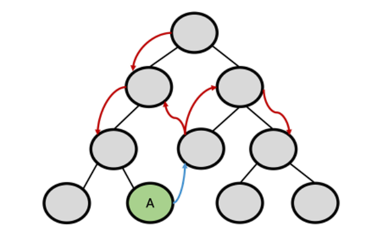
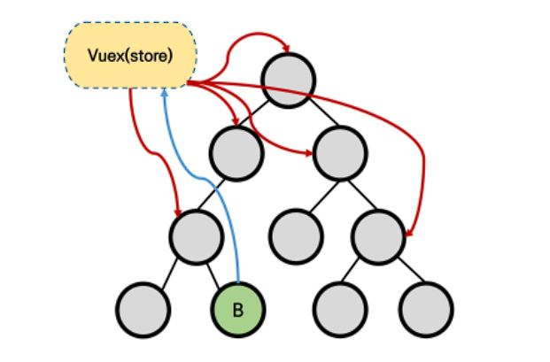
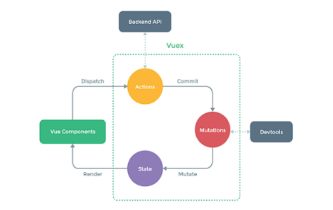
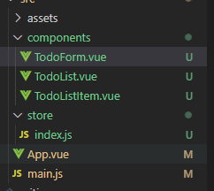
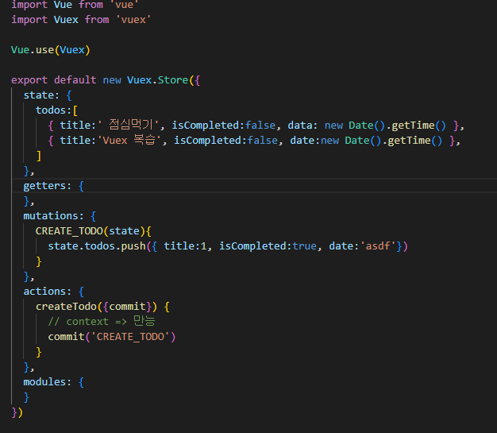
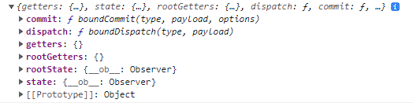
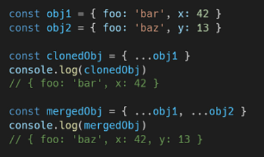
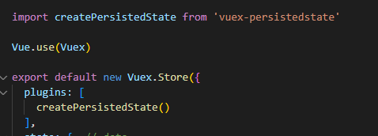

# Vuex

> Statement management pattern + Library
>
> state를 전역 저장소로 관리할 수 있도록 지원하는 라이브러리
>
> 애플리캐이션의 모든 컴포넌트에 대한 **중앙 집중식 저장소**


### State

> 'data' => 애플리케이션의 핵심


### 기존 Pass props & Emit event



* 각 컴포넌트에서 독립적으로 각자 다른 데이터를 관리

* 단방향 흐름

* 장점 

  * 데이터 흐름 직관적 파악

* 단점

  * 컴포넌트 중첩이 깊어질수록 데이터 전달 불편함

    

### Vuex management pattern



* 중앙 저장소(store)에 state(data)를 모아놓고 관리
* 규모가 큰 프로젝트에서 매우 효율적
* 각 컴포넌트에서는 중앙 집중 저장소의 state만 신경 쓰면 됨


## Vuex Core Concepts



### State

* 중앙에서 관리하는 모든 상태 정보(data)
  * 애플리케이션의 모든 상태를 포함하는 원본소스
  * 각 애플리케이션마다 하나의 저장소만 갖게 됨.
  * 각 컴포넌트가 중앙 Vuex Store에서 state 정보를 가져와 사용


### Mutations

* 실제로 state를 변경하는 **유일한 방법**
* mutation의 handler는 반드시 동기적
  * 비동기적 로직은 실제 호출 되는 시기를 알 수 없기 때문
* 첫번째 인자로 항상 state를 받음 => state 변경하기 때문
* Actions에서 commit()메서드로 호출됨


### Actions

* Mutations와 유사하지만 직접 state를 변경하지 않음
  * mutations 를 commit()으로 호출해서 실행
  * mutations와 달리 비동기 작업 가능
* context 객체 인자를 받음
  * context를 통해 store/index.js 파일 내에 있는 모든 요소의 속성 접근 & 메서드 호출 가능
* 컴포넌트에서 dispatch() 메서드에 의해 호출됨


### Getters

* state를 변경하지 않고 활용하여 계산을 수행 (computed 와 비슷)
* getters가 state를 변경하지는 않고 계산된 값만 가져옴


## 시작하기

```bash
$ vue create todo-vuex-app

$ vue add vuex
```



* index.js
  * Vuex core concepts가 작성되는 곳




### vuex를 사용해도 v-for을 사용하게 되면 props로 받아야 함


### context

* console.log(context)




* $store
  * index.js의 store로 접근 가능


* dispatch()
  * store의 action 함수 호출 가능


## JavaScript 문법

### Destructuring assignment

* 객체의 속성을 고유한 변수로 압축 해제

```vue
createTodo (context, newTodo) {
    context.commit('CREATE_TODO', newTodo)
}
```

위의 코드와 아래의 코드는 동일 ,아래의 코드는 commit 만 빼온 것 

```vue
createTodo ({ commit }, newTodo) {
	commit('CREATE_TODO', newTodo)
}
```


### Spread Syntax




### splice

> https://developer.mozilla.org/ko/docs/Web/JavaScript/Reference/Global_Objects/Array/splice

```
array.splice(start[, deleteCount[, item1[, item2[, ...]]]])
```

* start
  * 배열의 변경을 시작할 인덱스
* deleteCount
  * 배열에서 제거할 요소의 수
* item1, item2
  * 배열에 추가할 요소입니다. 아무 요소도 지정하지 않으면 `splice()`는 요소를 제거하기만 합니다.

```vue
DELETE_TODO (state, todo) {
    const index = state.todos.indexOf(todo)
    state.todos.splice(index, 1)
}
```


### class 구문

```vue
<span @click="updateTodo" :class="{'is-completed': todo.isCompleted}">
    {{ todo.title }}
</span>

<style>
.is-completed{
  text-decoration: line-through;
}
</style>
```

```
todo.isCompleted => true 이면 'is-completed' 활성화 => style 생김
```


### component Binding Helper

> 코드 없이 바로 매핑하도록 도와줌
>
> 항생 배열로 인자 넣어줘야 함
>
> Spread Operator 로 객체를 복사하여 작성

* mapState
  * **computed**와 Store의 **state** 매핑

* mapGetters
  * **computed**와 **Getters**의 state 매핑

* mapActions

  * **methods**와 **Actions**의 state 매핑
  * dispatch()로 보내준 this.todo(data) 는 pass prop으로 변경해서 전달해야 함

  ```vue
  <button @click="deleteTodo(todo)">[x]</button>
  ```

  * **함수 실행이 아닌, todo를 인자로 해서 함수 자체를 보내는 것** 

* mapMutations
  * mutations는 actions 거쳐야 하므로 pass~


## LocalStorage

### 직접 코드


### vuex-persistedstate

```bash
$ nmp i vuex-persistedstate
```




