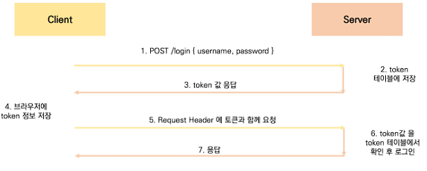

# Vue 04

## Server & Client


* Server는 "정보 제공"
  * DB와 통신하며 데이터를 CRUD
  * 요청을 보낸 Client에게 이러한 정보를 응답
* Client는 "정보 요청 & 표현"
  * Server에게 정보 요청
  * 응답 받은 정보를 가공하여 화면에 표현


#### 데이터 모델링 & 요청과 응답에 대한 형식을 서로 상의해서 맞춤


## CORS


### SOP(Same-origin policy)

> "동일 출처 정책"
>
> 브라우저의 간섭 => 요청과 응답은 이루어지지만, 브라우저에서 막음

* URL 의 Protocol, Port, Host가 모두 같아야 동일한 출처


| URL                                             | 결과 | 이유                              |
| ----------------------------------------------- | ---- | --------------------------------- |
| http://store.company.com/dir2/other.html        | 성공 | 경로만 다름                       |
| http://store.company.com/dir/inner/another.html | 성공 | 경로만 다름                       |
| https://store.company.com/secure.html           | 실패 | 프로토콜 다름                     |
| http://store.company.com:81/dir/etc.html        | 실패 | 포트 다름(http:// port 기본값 80) |
| http://news.company.com/dir/other.html          | 실패 | 호스트 다름                       |


### CORS(Cross-Origin Resource Sharing)

> "교차 출처 리소스 공유"
>
> **추가 HTTP header를 사용** => 다른 출처의 자원에 접근 할 수 있는 권한 부여하도록 브라우저에게 알림
>
> 다른 출처 리소스 불러오려면 **올바른 CORS header을 포함한 응답 반환** 필요

* CORS는 HTTP의 일부, 서버에 저장하여 사용


### Why CORS?

> https://developer.mozilla.org/ko/docs/Web/HTTP/Headers

1. 브라우저 & 웹 애플리케이션 보호
   * 악의적인 사이트 데이터 가져오지 않도록 사전 차단
   * 응답 자원에 대한 최소한의 검증
2. Server의 자원 관리
   * 누가 해당 리소스에 접근 할 수 있는지 관리 가능 

* CORS HTTP 응답 헤더 예시
  * Access-Control-Allow-Origin
  * Access-Control-Allow-Credentials
  * Access-Control-Allow-Headers
  * Access-Control-Allow-Methods

#### Access-Control-Allow-Origin

> https://developer.mozilla.org/ko/docs/Web/HTTP/Headers/Access-Control-Allow-Origin

> 이 응답이 주어진 출처로 부터 요청 코드와 공유 될 수 있는지 나타냄

* https://localhost:8080(Vue.js) ->  https://lab.ssafy.com(Django)

1. Vue.js 에서 서버로 요청
2. 서버는 Access-Control-Allow-Origin 포함 시켜 응답
3. 브라우저는 확인 후 허용 여부 결정


### django-cors-headers 라이브러리

> origin 이 다를 때 무조건 사용해야 함.
>
> 응답에 CORS header 추가해주는 라이브러리

```bash
$ pip install django-cors-headers
```

* settings.py

```python
INSTALLED_APPS = [
    'corsheaders'
]

MIDDLEWARE = [
    # CommonMiddleware 보다 위에 위치시켜야함
    'corsheaders.middleware.CorsMiddleware',
    'django.middleware.common.CommonMiddleware',
    
]

# 교차 출처 자원 공유 허가하는 Domain 등록
CORS_ALLOWED_ORIGINS = [
    'http://localhost:8080'
]
```


## Authentication & Authoriazation


### Authentication

* 인증, 입증
* 로그인 하는 행위가 인증 하는 행위
* 401 Unauthorized


### Authorization

* 권한 부여, 허가
* 로그인 됐다고 뭐든 권한을 부여하지는 않음
* 카페 등급 같은 것
* 403 Forbidden


## DRF Authentication

> Vue를 사용하기 위해서 로그인(인증)절차도 DRF로 실행

* 다양한 인증 방식
  * Session Based
  * Token Based
    * **Basic Token**
    * JWT
  * Oauth
    * google
    * naver
    * kakko

#### Session 과 Token은 방식은 동일, 어디에 저장하냐 차이


### Basic Token




### JWT

> JSON Web Token
>
> JWT 자체에 JWT 자체로 검증 가능 JWT 안에 이미 모든 권한이 들어있음

* JWT는 DB 유효성 검사 필요 없음(self-contained) => 세션 혹은 기본 토큰 기반과 큰 차이점
* 토큰 탈취시 서버 측에서 토큰 무효화가 불가능(블랙리스팅 테이블 활용)
* 안전을 위해 짧은 유효기간
* One Source(JWT) Multi Use


### 'dj-rest-auth' & 'django-allauth'

> https://www.django-rest-framework.org/api-guide/authentication/#django-rest-durin

```bash
$ pip install django-allauth
$ pip install dj-rest-auth
```


* settings.py

```python
INSTALLED_APPS = [
   
    'rest_framework',
    'rest_framework.authtoken',  # token 기반 auth
    # DRF auth
    'dj_rest_auth',  # signup 제외 auth 관련 담당
    'dj_rest_auth.registration',  # signup 담당

    # signup 담당을 위해 필요 
    'allauth', 
    'allauth.account',
    'allauth.socialaccount',
    
    'django.contrib.sites',
]

SITE_ID = 1

# DRF 인증 관련 설정
REST_FRAMEWORK = {
    'DEFAULT_AUTHENTICATION_CLASSES': [
        'rest_framework.authentication.TokenAuthentication',
    ],
    'DEFAULT_PERMISSION_CLASSES': [
        # 모두에게 허용
        # 'rest_framework.permissions.AllowAny', 

        # 인증된 사용자만 모든일이 가능 / 비인증 사용자는 모두 401 Unauthorized
        'rest_framework.permissions.IsAuthenticated'
    ]
}
```


#### 그 외

```
Article json 을 받았을 때  user, comments, like_users 는 결국 참조key값만 갖고 오기때문에

원하는 정보를 표현하기 위해서는 참조key를 갖고 다시 요청을  보내야 함.

그렇기 때문에 처음 json 받아올 때 key값을 갖고오는 것이 아니라 key로 상세정보 한번에 받아오기

=> 시리얼라이저에서 comments, user, like_users 는 단순히 필드로만 작성하는 것이 아니라 추가적으로 작성


get_user_model() 같은 경우도  매번 호출 되는 것보다 최상단에 User=get_user_model() 이후 User로 사용하는 것이 더 효율적
```


토큰으로 관리하면 쿠키 삭제해도 로크아웃 처리 안되는건가???


권한을 나눌 수 없나?? 어떤건 아무나 접근 가능, 어떤건 인증된사람만 접근가능