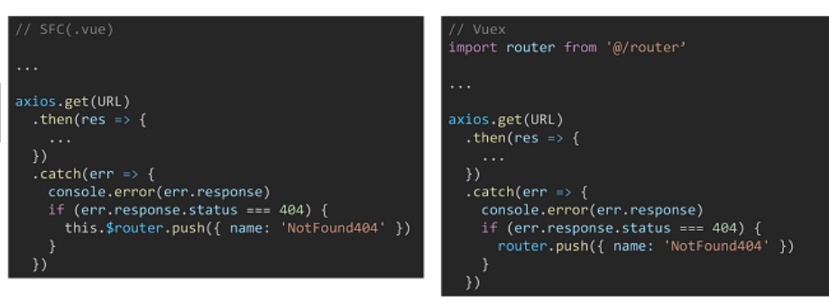

# Vue 05

* node_modules 받기 위해  ==> pip install requirements.txt 랑 같음 

```bash
$ npm install
```


## api / drf.js


### 404 page

> 지정한 url 이외의 모든 url 을 404로 보여주려면 404 vue 도 만들어야 함

* Vue Router에 등록되지 않은 routes 일 경우

  * ex) /no-such-routes

  

```vue
// @/router/index.js

const routes = [
	...
	{
	path:'/404',
	name: 'NotFound404',
	component: NotFound404
	},
	{
	path:'*',
	redirect:'/404'
	}	
]
```


* Vue Router 에는 등록되어 있지만, 서버에서 해당 리소스를 찾을 수 없는 경우
  * ex) /articles/98283847273




## Navigation Guard

