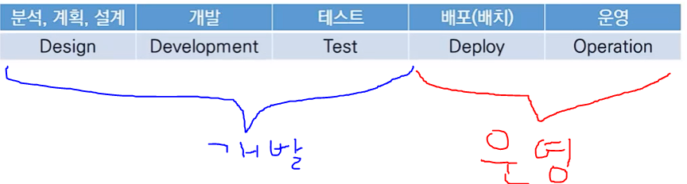
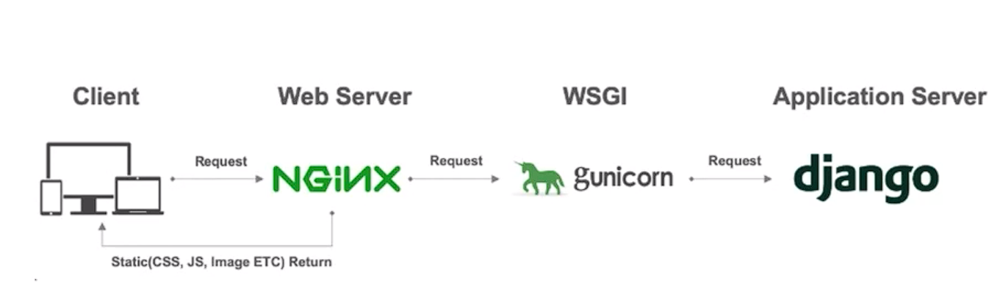

# 배포

> 소프트웨어 전개(software deployment) : 소프트웨어 시스템을 사용할 수 있도록 만드는 모든 활동
>
> 소프트웨어 배포(software distribution) : 최종 사용자에게 소프트웨어를 전달하는 과정

과거 : 소프트웨어 설치를 디스크, 혹은 cd로 사용자 컴퓨터에 설치

현재 : 인터넷을 통해 사용자가 사용자 컴퓨터에 설치 (Native App)

​     혹은 웹을 통해 설치 없이 사용 (Web App)

### Web App

제공자의 컴퓨터에 제공자가 설치 => 접속만하면 사용자는 설치없이 사용자의 컴퓨터로 사용 가능

=> 설치를 어디에 할 것인가?

=> 1. 서버 하드웨어를 직접 설치하고, 직접 관리 유지 하는 방법

=> 2. 빌려 쓰는 방법 (Cloud)  ex) AWS, Azure, GCP

## Server 배포

