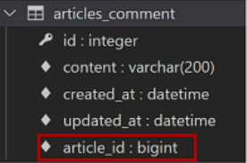
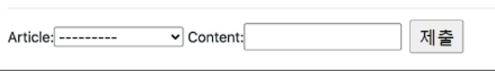
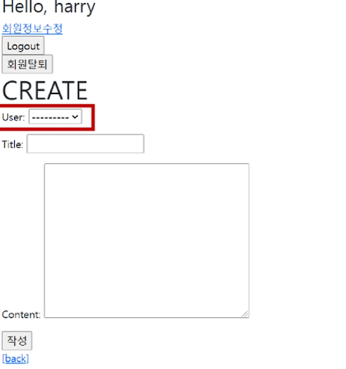
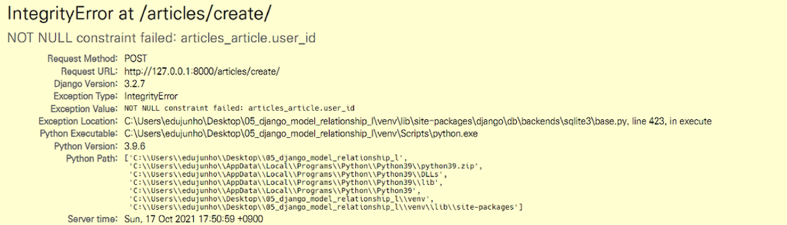

# Model RelationShip


## Foreign Key(외부 키)

> 참조 테이블에서 필드(열)에 해당, 참조되는 테이블의 행 1개에 대응됨.
>
> 여러개의 키가 한개의 행에 대응될 수 있음
>
> 없는 행을 참조할 수 없음


### 1:N 구조

* Article(1)

|  id  | title | content |
| :--: | :---: | :-----: |
|  1   | 제목1 |  내용1  |
|  2   | 제목2 |  내용2  |
|  3   | 제목3 |  내용3  |


* Comment(N)

|  id  | content | foreign key |
| :--: | :-----: | :---------: |
|  1   |  댓글1  |      3      |
|  2   |  댓글2  |      1      |
|  3   |  댓글3  |      1      |
|  4   |  댓글4  |      2      |


### N쪽인 Commnet 에서 1인 Article의 키(id)를 필드로 갖게됨.


### 참조 무결성

* DB 관계 모델에서 참조하는 테이블의 foreign key 는 참조되는 테이블의 유일한 값이어야 한다.
* 반드시 기본 키일 필요는 없지만, 유일한 값이어야 함.


### ForeignKey field

> Field가 붙지않음.
>
> 2개의 필수 인자 - 1. 참조하는 model class  2. on_delete 

```python
# articles/models.py

class Comment(models.Model):
    # 참조하는 모델명을 소문자로 해서 변수명 작성
    article = models.ForeignKey(Article, on_delete=models.CASCADE)
    content = models.CharField(max_length=200)
    created_at = models.DateTimeField(auto_now_add=True)
    updated_at = models.DateTimeField(auto_now=True)
```


* migrate 후



> 장고에서 _id를 붙여서 만들어줌

comment.article_id = article.pk

comment.article = article

#### _id를 붙이냐 안붙이냐에 따라서 객체 전체를 넘겨주냐 pk값만 넘겨주냐가 다르다.


#### on_delete

> 외래 키가 참조하는 객체(본문)가 사라졌을 때 외래 키를 가진 객체를 어떻게 처리할 지를 정의

* CASCADE : 부모 객체(참조 된 객체)가 삭제 됐을 때 이를 참조하는 객체도 삭제
* PROTECT
* SET_NULL
* SET_DEFAULT
* SET()
* DO_NOTHING
* RESTRICT


### 1:N 관계 related manager

* 역참조 (comment_set)
  * 1(참조를 당하는 쪽) 에서 참조를 하는 쪽을 참조한는 것
  * Article(1) -> Comment(N)
  * Article 클래스에는 Comment와의 어떠한관계작성이 없기 때문에 article.comment_set
* 참조
  * Comment(N) -> Article(1)


```python
comments = article.comment_set.all()
for comment in comments:
	print(comment.content)
```


* ForeignKey의 인자로 related_name을 통하여 comment_set 바꿔줄수 있음
* 1:N 관계와 M:N관계 구별을 위해 그대로 사용한느 것을 권장


## Comment Create


### CommentForm

```python
# articles/forms.py

from .models import Article, Comment

class CommentForm(forms.ModelForm):
    
    class Meta:
        model = Comment
        fields = '__all__'
        
        
# articles/views.py

from .forms import ArticleForm, CommentForm

def detail(request,pk):
    article = get_object_or_404(Article, pk=pk)
    comment_form = CommentForm()
    context={
        'article':article,
        'comment_form':comment_form
    }
    return render(request, 'articles/detail.html', context)

```


```django
<!--articles/detail.html-->

{{ comment_form }}
```

* ForeignKey 의 참조 키값을 직접 입력하는 상황이 생김




* forms.py 에서 field를 수정
  * exclude를 통해 'article'(외래키) 부분을 제외시킴
  * urls.py 에서 \<int:pk>를 통해서 받으면 됨
  * pk 받고 views에서 처리해주면 됨

​		

```python
# articles/views.py

def comments_create(request, pk):
    article = get_object_or_404(Article, pk=pk)
    comment_form = CommentForm(request.POST)
    if comment_form.is_valid():
        # commit default 값은 True
        # DB에 저장은 안하고 인스턴스값만 반환 하기 위해 False 설정
        comment = comment_form.save(commit=False)
        comment.article = article
        comment.save()
    return redirect('articles:detail', article.pk)
```

??? - comment_form = CommentForm(request.POST)

​		comment_form.article_id = article.pk

​		comment_form.save()


모델폼의 객체와    save 의 객체 


## Comment READ


```python
# articles/views.py

from .forms import ArticleForm, CommentForm

def detail(request,pk):
    article = get_object_or_404(Article, pk=pk)
    comment_form = CommentForm()
    comments = article.comment_set.all()
    context={
        'article':article,
        'comment_form':comment_form,
        'comments':comments
    }
    return render(request, 'articles/detail.html', context)
```


```django

  <li>{{ comment.content }}</li>

```


## Comment DELETE

> 게시글의 pk와 댓글의 pk 가 모두 필요함


```django

  <li>{{ comment.content }}
	<form action=
          method="POST"
          class="d-inline">
        
        <input type="submit" value="제출">    
     </form>
  </li>

```


```python
# articles/urls.py

urlpatterns = [
    path('<int:article_pk>/comments/<int:comment_pk>/delete/', 		          		views.comments_delete,
      name='comments_delete')
]

# articles/views.py

@require_POST
def comment_delete(request, article_pk ,comment_pk):
    if request.user.is_authenticated:
        comment = get_object_or_404(Comment, pk=comment_pk)
        if request.user == comment.user:
            comment.delete()
    return redirect('articles:detail', article_pk)
```


#  Customizing authentication in Django


## Substitutin a custom User model

> 장고의 내장 User 모델이 원하는 형식이 아닐 수 있음 ex) username => email
>
> default user model 재정의 가능  => AUTH_USER_MODEL
>
> 첫 마이그래이션 하기 전에 재정의 하여야 함.


### AUTH_USER_MODEL

> User을 나타내는데 사용하는 모델
>
> default : 'auth.User'


```python
# accounts/models.py

from django.contrib.auth.models import AbstractUser

# 일단 pass 로 뚫어놓고 프로젝트 진행하면 나중에 변경 가능
class User(AbstractUser):
    pass


# pjt/settings.py

AUTH_USER_MODEL='accounts.User'

# accounts/admin.py

from django.contrib.auth.admin import UserAdmin
from .models import User

admin.site.register(User, UserAdmin)

```


### User 을 커스텀으로 변환하면 모델폼에서 문제 발생


* UserCreationForm

* UserChangeForm


=> 이 두개의 모델폼의 Meta class 를 보면 

 	model = User 로 되어 있기 때문에 커스텀 User로 변경필.


```python
# accounts/forms.py

from django.contrib.auth.forms import UserCreationForm, UserChangeForm
from myapp.models import CustomUser
from django.contrib.auth import get_user_model

class CustomUserChangeForm(UserChangeForm):

    # password = None

    class Meta:
        model = get_user_model() # User
        fields = ('email', 'first_name', 'last_name',)


class CustomUserCreationForm(UserCreationForm):

    class Meta(UserCreationForm.Meta):
        model = get_user_model()
        fields = UserCreationForm.Meta.fields + ('email',)


```

=>> models.py 가 아니기 때문에 get_user_model() 사용 


### get_user_model()

> 현재 프로젝트에서 **활성화된 사용자 모델**을 반환 => 클래스 자체, 인스턴스 x

**=> User클래스를 직접 참조한는 것이 아니라 get_user_model()을 사용하여 참조!!!!**


## Model RelationShip2


1. settings.AUTH_USER_MODEL

* return 값이 str
* models.py 에서만 사용


2. get_user_model()

* return 값이 object
* models.py를 제외한 모든 곳에서 2번 사용 => import 순서때문


### 장고 app 실행 순서

1. installed_app에서 순차적으로 app import
2. 각 앱의 models를 앱순서대로  import


### User(1) - Article(N)

> 유저 한명이 여러개의 article을 작성한다.

```python
# articles/models.py

from django.conf import settings
# models.py 에서는 settings를 사용한다.
class Article(models.Model):
    user = models.ForeignKey(settings.AUTH_USER_MODEL, on_delete=models.CASCADE)
```





* forms.py 에서 fields 부분에 all로 하게 되면 article 작성할때 user을 정하는 칸이 생김.

=> fields 부분 수정 =>  user_id 부분은 넣어주어야 함.  =>   views 수정


* user_id 없으면 낫 널 오류




```python
# articles/views.py


@login_required
@require_http_methods(['GET', 'POST'])
def create(request):
    if request.method == 'POST':
        form = ArticleForm(request.POST)
        if form.is_valid():
            # 저장 x, 인스턴스만 생성 
            article = form.save(commit=False)
            article.user = request.user
            article.save()
            return redirect('articles:detail', article.pk)
    else:
        form = ArticleForm()
    context = {
        'form': form,
    }
    return render(request, 'articles/create.html', context)


@require_POST
def delete(request, pk):
    article = get_object_or_404(Article, pk=pk)
    if request.user.is_authenticated:
        # 작성자가 아니라면 삭제 불가 => 수정부분도 동일하게 
        if request.user == article.user:
            article.delete()
    return redirect('articles:index')
```


```django
# detail.html

# html 에서 작성자아니면 아예 출력안되게 변경 가능 

```


### User(1) - Comment(N)

> 한명의 User가 여러개의 Comment 작성 가능


```python
# articles/models.py

from django.db import models
from django.conf import settings

class Comment(models.Model):
    # article 하나에 여러개의 comment 가능
    article = models.ForeignKey(Article, on_delete=models.CASCADE)
    # 한명의 유저가 여러개의 comment 가능 
    user = models.ForeignKey(settings.AUTH_USER_MODEL, on_delete=models.CASCADE)
```


### 이 후는 위와 비슷함


