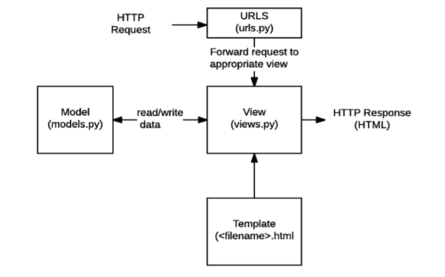
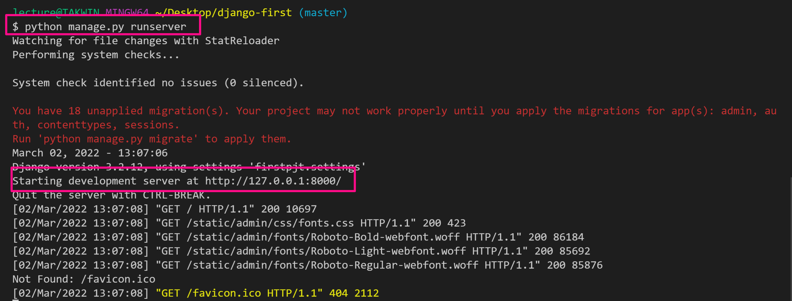
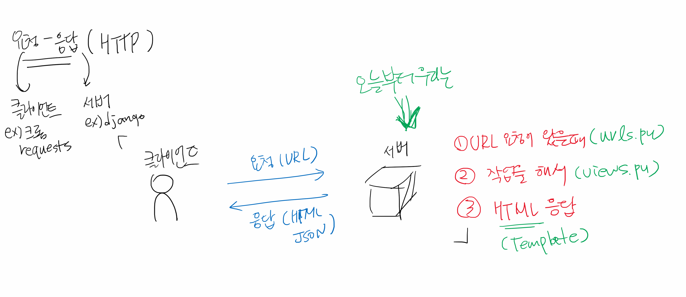
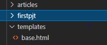
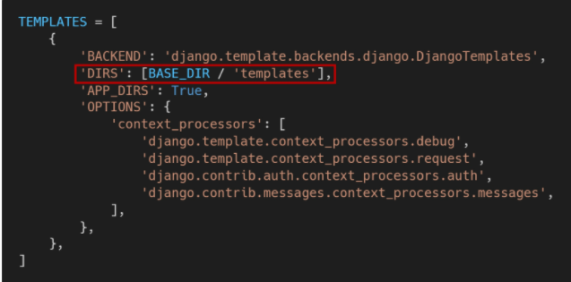

# Django 처음 시작하기

## 관련 문서 정리

| 개념              | 링크                                                         | 비고     |
| ----------------- | ------------------------------------------------------------ | -------- |
| render            | https://docs.djangoproject.com/ko/3.2/topics/http/shortcuts/#render | views    |
| request object    | https://docs.djangoproject.com/en/3.2/ref/request-response/  | views    |
| URL               | https://docs.djangoproject.com/ko/3.2/topics/http/urls/#path-converters | url      |
| template tag      | https://docs.djangoproject.com/en/3.2/ref/templates/builtins/ | template |
| HTTP              | https://developer.mozilla.org/ko/docs/Web/HTTP               | HTTP     |
| template settings | https://docs.djangoproject.com/en/4.0/ref/settings/#templates | settings |


### Static web page

* 모든 상황에서 모든 사용자에게 동일한 정보 표시

  

### Dynamic web page

* 서버가 추가적인 처리 과정 이후 클라이언트에 응답 보냄
* 방문자와 상호작용
* 서버 사이드 프로그래밍 언어(Python, Java)


### Framework

* 표준 구조를 구현하는 클래스와 라이브러리 모음
* 코드를 처음부터 시작하지 않아도 됨
* 어려움을 줄이는 것이 주 목적(데이터베이스 연동, 템플릿 형태의 표준, 세션 관리, 코드 재사용 등의 기능)


### ** framework 를 하나만 사용하면 편할 것 같은데 다양하게 사용하는 이유가 무엇인가요?? **

> 각각의 framework 마다 특징들이 다르고 언어가 달라서.


### 아키택처

* MVC( model-view-controller) Design Pattern
* MTV Pattern (model-Template-View)
  * Model : 데이터베이스 기록 관리
  * Template : 파일 구조 레이아웃 정의
  * view : HTTP 요청을 수신하고 응답을 반환, 데이터 접근


### 처리구조




### 진행순서

1. 가상환경 생성 및 활성화

2. django 설치

3. 프로젝트 생성

4. 서버 켜서 로켓 확인

5. 앱 생성

6. 앱 등록


# Django


## 1. 가상환경

> 프로젝트별로 pip로 설치되는 패키지를 독립적으로 관리하기 위하여 
>
> 가상환경 - 독립적인 개발환경 -> 다른사람과 프로젝트를 진행할 때 가상환경으로 환경 통일

### 가상환경 생성

```bash
$ python -m venv venv
```

### 가상환경 실행

* `venv` 폴더 내의 스크립트를 실행 시키는 것

```bash
$ source venv/Scripts/activate
(venv)
```

### 가상환경 종료

```bash
$ deactivate
```


## 2. Django 설치

```bash
$ pip install django==3.2.12
```

* 혹시라도 4.x 버전을 설치한 경우 삭제 후 재설치 

```bash
$ pip uninstall django
```


## 3. Django 서버 실행

* 서버 종료는 `ctrl + c` 로 한다.

```bash
$ python manage.py runserver
```




## 4. Django 개발하기

> 각 App에 MTV에 해당하는 기능을 구현한다.

### app 생성

```bash
$ python manage.py startapp 앱이름
```

* app  생성을 하면, 바로 등록을 진행한다.

```python
# firstpjt/settings.py
INSTALLED_APPS = [
    '앱이름',
    'django.contrib.admin',
    'django.contrib.auth',
    'django.contrib.contenttypes',
    'django.contrib.sessions',
    'django.contrib.messages',
    'django.contrib.staticfiles',
]

```

### 기본 개발 흐름



#### 1) URL 설정

* URL과 해당 URL로 요청오면 실행시킬 view의 함수를 지정한다.

```python
from django.contrib import admin
from django.urls import path
# aritlces 앱의 views.py
from articles import views

urlpatterns = [
    path('admin/', admin.site.urls),
    # URL을 index/ 들어오면, 
    # index 함수를 실행시킬 것이다.
    path('index/', views.index),
    path('bts/', views.bts),
]

```

#### 2) views.py

* 함수를 정의할 때 반드시 첫번째는 `request`

  * request 객체 정보 : https://docs.djangoproject.com/en/3.2/ref/request-response/

  * 출력 예시

    ```
      ['COOKIES', 'FILES', 'GET', 'META', 'POST', '__class__', '__delattr__', '__dict__', '__dir__', '__doc__', '__eq__', '__format__', '__ge__', '__getattribute__', '__gt__', '__hash__', '__init__', 
      '__init_subclass__', '__iter__', '__le__', '__lt__', '__module__', '__ne__', '__new__', '__reduce__', '__reduce_ex__', '__repr__', '__setattr__', '__sizeof__', '__str__', '__subclasshook__', '__weakref__', '_current_scheme_host', '_encoding', '_get_full_path', '_get_post', '_get_raw_host', 
      '_get_scheme', '_initialize_handlers', '_load_post_and_files', '_mark_post_parse_error', '_messages', '_read_started', '_set_content_type_params', '_set_post', '_stream', '_upload_handlers', 'accepted_types', 'accepts', 'body', 'build_absolute_uri', 'close', 'content_params', 'content_type', 'csrf_processing_done', 'encoding', 'environ', 'get_full_path', 'get_full_path_info', 'get_host', 'get_port', 'get_raw_uri', 'get_signed_cookie', 'headers', 'is_ajax', 'is_secure', 'method', 'parse_file_upload', 'path', 'path_info', 'read', 'readline', 'readlines', 'resolver_match', 'scheme', 'session', 'upload_handlers', 'user']
    ```

* 함수 return은 `render` 함수 활용

  * https://docs.djangoproject.com/ko/3.2/topics/http/shortcuts/#render
  * 필수 인자
    * request
    * template 이름

```python
# index 함수는
# 어떠한 작업을 하고 (아직 쓰지 않음)
# index.html을 랜더링할 것이다.
def index(request):
    # 작업
    return render(request, 'index.html')
```

#### 3) templates

* templates 폴더는 반드시 app 폴더 내부에 생성한다.

```html
<!-- articles/templates/index.html -->
<h1>안녕</h1>
```


### ???  수명 주기 끝나면 버전 종료 인건가?? 수명 주기를 미리 정해놓는 이유가 있는지..


#### LTS

* Long Term Support (장기 지원 버전)
* 제품 수명주기 관리 정책임
* 수정을 하며 장기적으로 지원하도록 고안된 버전


 ## URL -> VIEW -> TEMPLATE(데이터의 흐름) 순서로 코드 작성


## Project & Application

프로젝트는 설정 제공, 여러 앱 포함 가능

앱은 실제 요청 처리, 일반적으로 앱은 하나의 역할 및 기능 단위로 작성함


### 앱 등록

* INSTALLED_APPS 리스트에 앱을 추가해야 함.
* **반드시 생성 후 등록**
* **1** Local apps, **2** Third party apps, **3** Django apps 순서로 작성한다.


### 프로젝트 구조

* settings.py : 애플리케이션의 모든 설정 포함
* urls.py : 사이트의  url과 적절한 views 의 연결 지정
* manage.py : Django 프로젝트와 다양한 방법으로 상호작용 


### Aplication 구조

* admin.py : 관리자용 페이지 설정하는 곳
* apps.py : 앱의 정보가 작성된 곳
* models.py : Model을 정의하는 곳
* tests.py : 테스트 코드를 작성하는 곳
* views.py : view 함수들이 정의 되는 곳


### settings 추가 설정

* LANGUAGE_CODE : 번역            * USE-18N 활성화 필수
* TIMEZ_ZONE : 데이터베이스 연결의 시간대             * USE_TZ 값 TRUE필수
* USE_I18N - internationalization
* USE_L10N - localization
* USE_TZ


## Temlplate

> Django Template Language(DTL)


### DTL Syntax

```python
urlpatterns = [
    path('admin/', admin.site.urls),
    path('index/', views.index),
    path('greeting/', views.greeting),
    path('dinner/', views.dinner),
    path('dtl-practice/', views.dtl_practice),
]

def dtl_practice(request):
    foods = ['짜장면', '탕수육', '짬뽕', '양장피']
    fruits = ['apple', 'banana', 'cucumber', 'mango']
    user_list = []
    context = {
        'foods': foods,
        'fruits': fruits,
        'user_list': user_list,
    }
    return render(request, 'dtl_practice.html', context)

```


1. Variable

   {{ variable }}

   ```django
   <p>{{ food }}</p>
   ```

   

2. Filters

   {{ name|lower }}

   ```django
   <p>{{ 'ABC'|lower }}</p>
   ```

   

   {{ foods|length }}

   ```django
   
       
         <p>이름이 너무 길어요.</p>
       
         <p>{{ fruit }}, {{ fruit|length }}</p>
       
   
   ```

   

   

3. Tags : 출력 텍스트, 반복, 논리 수행

   

   ```django
   
       <p>짜장면엔 고추가루지 !</p>
   
   ```

   

   

   ```django
   
       <p>{{ forloop.counter }} {{ food }}</p>
   
   ```

   

4. Comments

   {# 주석 #}

   

   

   

​		

### Template inheritance (템플릿 상속)

* 코드의 재사용을 위하여
*  기본 뼈대 템플릿 편의상 base.html

#### tags

 : 자식템플릿 최상단에서 부모 템플릿 확장한다는 것을 알림

```django

```


****  ** **base.html 는 app_name/templates 경로 외 경로로 템플릿 추가 설정** **



setttings.py 에서 템플릿 추가 




 : 템플릿 내에 다른 템플릿을 포함시킴 * 언더바는 단순히 include 템플릿이라는 걸 알												림


### ??? for i in range(n)  


pull한 장고 서버 실행하려면 어떻게 해야 하나요??


