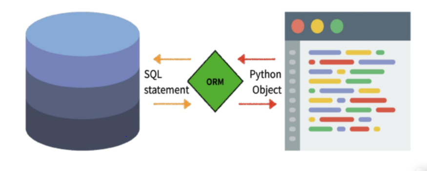

# Model

> 모델링을 생각하자!!

* Django 에서는 model 을 통해 데이터에 접속하고 관리
* 각각의 model 은 하나의 데이터베이스 테이블에 매핑되는 것이 일반적
* 데이터를 구조화하고 조작하기 위한 도구


## Database(DB)

> 체계화된 데이터의 모임


### 쿼리(Query)

* 데이터를 조회/ 추출/ 조작 하기 위한 명령어

  ex) "Query를 날린다." -> DB를 조작한다.


### 스키마(Schema)

* DB 자료들의 구조, 표현방법, 관계 등을 정의한 구조
* 메타데이터의 집합


### 테이블(Table)

* 열 : 필드 or 속성
* 행 : 레코드 or 튜플


### ### PK(Primary Key) 기본키는 레코드를 나타내는 고유값 ###

### ### django에서 id로 알아서 생성됨 ###


## ORM

> **Object-Relational-Mapping**
>
> Django -- SQL 간의 데이터를 변환하는 프로그래밍 기술




* 장단점

  * 장점 

    * SQL 몰라도 DB 조작가능
    * 절차적 접근인 SQL 과 다르게 객체 지향적 접근

  * 단점

    * ORM 만으로 완전한 서비스 구현 힘듦

     

### ### DB를 객체로 조작하기 위해 ORM을 사용한다. ###


```python
# articles/modles.py

class Article(models.Model):
    title = models.CharField(max_length=10)
    content = models.TextField()
```


* django/db/models/base.py 의 Model 클래스를 상속받음
* CharField 랑 TextField는 django/db/models/fields 안에 있는 Class.


## Migrations

> Django가 model에 생긴 변화를 반영하는 방법.


### makemigrations

> 새로운 마이그레이션(설계도) 만듦


### migrate

> 마이그레이션을 DB에 반영하기 위해 사용
>
> 

### sqlmigrate

> 마이그레이션에 대한 SQL 구문을 보기 위해 사용


### showmigrations

> 프로젝트 전체 마이그레이션 상태를 확인하기 위해 사용
>
> migrate 됐는지 여부 파악 가능


## model 수정

1. models.py


2. $ python manage.py makemigrations


3. $ python manage.py migrate


## Database API

> DB를 조작하기 위한 도구

* model을 만들면 Django는 객체들을 만들고 읽고 수정하고 지울 수 있는 database-abstract API를 자동으로 만듦.


### DB API 

* Manager
  * query 작업이 제공되는 인터페이스
* QuerySet
  * 데이터베이스로부터 전달받은 객체 목록
  * 조회,필터,정렬 수행 가능


### Django shell

* 일반 python shell 로는 장고 프로젝트 환경 접근 불가
* 따라서 장고 프로젝트 설정이 load된 python shell 사용
* 더 많은 기능 제공하는 shell_plus 사용(django-extensions라이브러리)


### ### settins.py INSTALLED_APPS 에 'django_extensions' 추가 필요 ##


## CRUD


### Create

```
1. 객체 지정

>>> article = Article()
>>> article.title = 'first'
>>> article.content = 'django!'
>>> article.save()

2.

>>> article = Article(title='second', content='django!!')
>>> article.save()

3.

>>> Article.objects.create(title='third', content='django!')


```


### Read

```
>>> Article.objects.all()
```

```
<QuerySet []>
```

```
all()
get(pk=2)
get(title='first')
filter(title='first')
```

* get 은 DoesNotExist, MultipleObjectsReturned 예외가 존재함. -> 고유값으로 찾아라!


### Update

```
>>> article = Article.objects.get(pk=1)
>>> article.title = 'byebye'
>>> article.save()
```


### Delete

```
>>> article = Article.objects.get(pk=1)
>>> article.delete()
```


### Field lookups

```
Article.objects.filter(pk__gt=2)
Article.objects.filter(content__contains='ja')
```

* 조회 시 특정 검색 조건을 지정할 수 있다.


vs code  M U


a2 = Article 이부분 변수 아닌지?


method get


1. settings.py 에 언어랑


2. html !tap 했을 때 설정하는 언어랑 뭐가 다른건지


a1 , a2 에 같은 클래스 인스턴스로 만들어주고


하나 삭제하면 어케되나??


Q. def create 에서

render 'artkcles/index.html' 하면 게시판안보임;;


-> 단순히 html 을 보여주냐??? 아니면 url 을 거쳤다가 그 view를 통해 html 을 보여주냐 차이네!


index.html 에서 

```html
<a href={% url 'articles:detail' article.pk % }></a>

```

```
article.pk 를 넣어준 이유 : articles:detail url 에서 <ink:pk> 를 받기 때문
```

