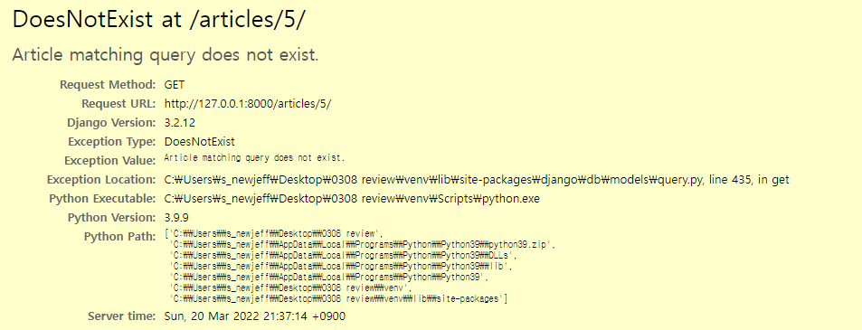
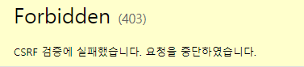
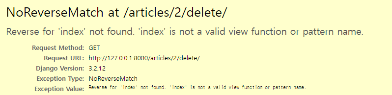
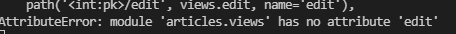
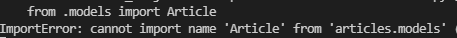
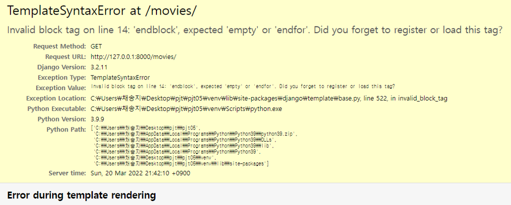
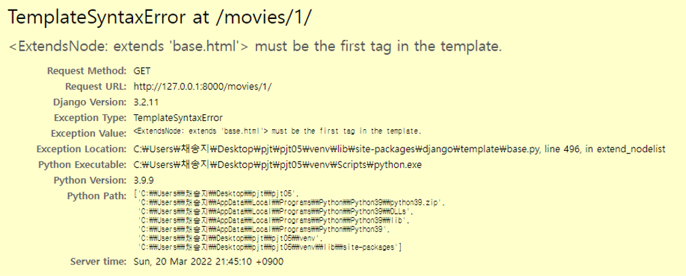
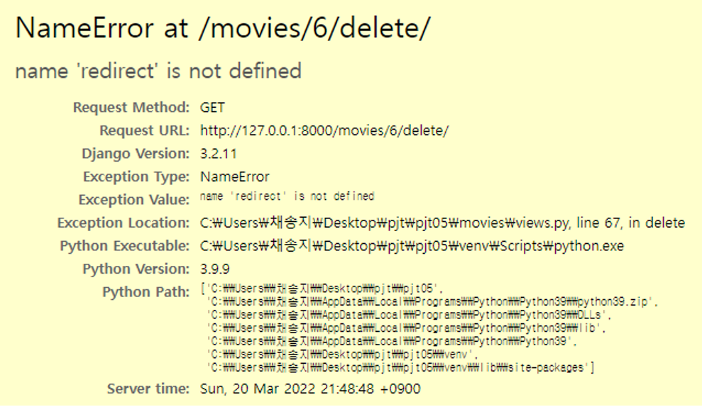
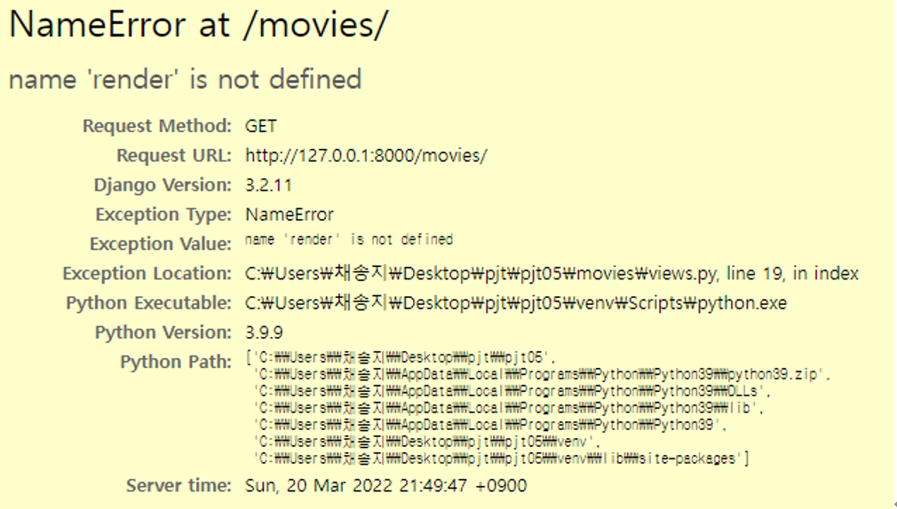
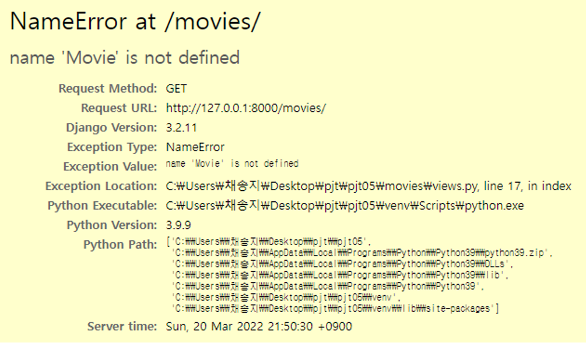

### 없는 주소 입력했을 때 (data에 없는 주소)

### csrf_token 사용하지 않고 method="POST" 했을 때

### redirect 이름 잘못 지정했을 때

### views.py 에서 함수 이름 지정 잘못했을 때

### models.py 에 Article 이없을때

### endfor 없을 때

### extends 최상단 아닐 때

### redirect , render import x

### import Movie x

