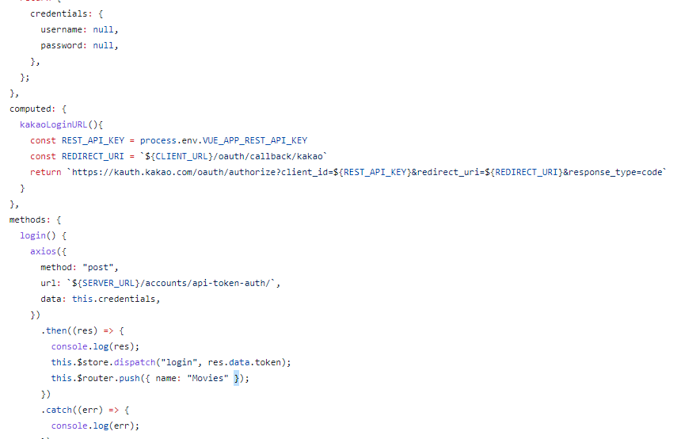

# final project

## 0516

-기술 스택  FE : tailwind, bootstrap, materialize (google), slide(carousel), 

​					BE(DRF) : DB seeding, / CBV(class based view), query

-아이디어 : 3~5개의 대표사이트 분석

-우선순위 : (다크모드), MVP(가장 가치있는 기능부터)

-프로젝트 : 개발 루틴( 개발 단위, 소통, DRFAPI) git을 쓸지 , commit

​					영화 데이터 어떻게 수집할지/ 어떤 형태로 관리할지

​					코드 스타일 컨벤션

​					DB : ERD /ux/ui 프로토 타입

데이터 획득 => api or 크롤링

  					크롤링의 경우 id 지정 어떻게 할지 정해야 함 

-기록으로 남김.

좋아요, 추천수

django DB =>  restframework => json

Vuex  store

created()

button @click  => django db      model   =>   djang DB 

디자인 기능구현

모델링  =>  api (json)

api => tmdb, map api

## django

accounts

movies

1. 

map api  => vue

google => map api

+ 영화관별 티켓 가격 및 팝콘 가격 알려주기

2. 

회원가입 => 장르 => 추천     +     예매기능(영화관 사이트로 보내주기)

주소 받을 때 자세하게   =>  Vue 로 

(넷플릭스)

3. 

회원가입 => 집주소 => 근처 영화관, 좋아하는 장르 영화 추천 => 비슷한 동네 나랑 비슷한 성향 매칭 => 팝콘 나눠먹기  => 나눠먹고 사진인증하면 포인트 적립

회원가입 => 카카오 로그인 추가 => 약관??

=> 성인인증 19세 영화를 위해

4. 

리스트뽑아낼 때 정렬방식을 ㄱㄴㄷ, 평점순, 관객순 

5. 평점 수정 => 자체 평점??

커뮤니티 기능 => 댓글, 좋아요, 팔로우,  대화 기능(?)             

저희 사이트 => 

업데이트

Tmdb

django(DB)              Vue

upcoming => vue axios로 

날씨 api, 배우로 영화 검색 , 장바구니 ( 내가 볼 영화 넣기 )  mymovielist

ott 별로 같이 신청할 사람 모집하는 기능 => 피클플러스

유저 검색 기능 

유저별로 

영화 평가수

별점 준 기록

장르 선호

선호 배우

선호 감독

선호 국가

영화마다 댓글

지도 api 영화관 추천 => 볼 영화 고르고 => lodash 팝콘을 먹을지 말지 

upcoming 영화 사진으로 랜덤하게 재생

나랑 영화 볼래?

오늘 뭐볼까

youtube 끌어오기 => 정확한 영상인지 어떻게 알지 

먹을까 말까 => 영화관가서 본다 가정했을 때 팝콘 먹을지 안먹을지 랜덤

## 0517

### tmdb

https://api.themoviedb.org/3/movie/popular : popular movie page 500까지 있음  한페이지에 20개있음 => 장고 db

https://api.themoviedb.org/3/movie/now_playing : 현재 상영작 page 3까지 

https://api.themoviedb.org/3/movie/upcoming: 곧 개봉작 page 1까지 총 12개

/movie/{movie_id}/credits : movie_id 넣으면 배우 목록 나옴 

/person/popular : 배우 리스트  => 장고 db  page500까지 

/genre/movie/list : 장르 리스트 => 장고 db    장르 20개

## 기본기능

장르에 따른 추천

배우에 따른 추천

날씨에 따른 추천(?)

평점 순,  연도 별 순 정렬

위치

성인인증하면 19금 보이고

안하면 안보이고

다크 모드

### ERD

### URL

/home  =>  App.vue + HomeView.vue + Components( Movie.vue + MovieCard.vue + MovieSearch.vue )

/account/login

/account/profile

/account/signup

회원탈퇴, 로그아웃은 버튼으로

/

#### django

##### db 데이터 가져오기

https://velog.io/@ready2start/Mollbar-%ED%8A%B8%EB%9F%AC%EB%B8%94-%EC%8A%88%ED%8C%85-%EC%98%81%ED%99%94-%EB%8D%B0%EC%9D%B4%ED%84%B0-%EA%B0%80%EC%A0%B8%EC%98%A4%EA%B8%B0

1. accounts app

2. movies.app

3. actors.app

Vue - django

localhost.      8000.

user custom

AUTH_USER_MODEL

#### Vue

vuex 사용 ,  router 사용

drf 로그인

### 도안

회원가입 기능은 로그인창 안에

### 지도

https://apis.map.kakao.com/web/guide/#step2

app 

accounts

movies => 댓글

actors

나중에 추가할 것:

팔로우,  날씨 api,  

### CSS 강의

span label input => 인라인 한줄에 표시됨

인라인은 css 안먹는다 css 하고싶으면  

display: inline-block; => 인라인으로 작용하지만 css 가능

flex container 가 가지고 있는 item 개념

item들이 container 안에 있고 container 을 flex로 

flex

direction ( row,  column)

main axis, cross axis

justify-content,    align-items

### 너비는 부모만큼,  높이는 자식만큼

position absolute

스크롤 따라오게 fixed

색상.....?

swiperjs.com/demos

## 0518 

edussafy 미확인 창

어느 부분까지 새로고침없이 비동기로 하고

어디 부터 새로고침을 사용해야 되는거지??

=> 서버의 차이인가?

static image는 어디다 사용해야 하는거지 

textfield    null=true 안해도 넘어오는지

logout 같은경우 post 요청인데 vue에 url로 접근해서 로그아웃 되게 해도 되는건가???

## 0519

만들어야할 페이지 

home

moviedetail

profile    -   위치 정보    map api

login

signup  => username , password, img 받아오기

signup2 =>  좋아하는 장르,  좋아하는 배우 

actorlist

actordetail

영화 추천 페이지

회원정보 수정 페이지

영화관찾는 페이지

Notfound404

django => Vue 로 영화 보내주는 거 성공

한번에 만개 못보냄 

vue에서 장고로 줄수있는건 url 뿐

데이터 100개씩 받아오기 성공 

배열 push 할때 배열에 배열들어가는거  ...배열

로 unpack 함

장고 import 경로 인스톨드앱에있으면 .. 없어도됨 

## 0521

vue  => django   csrf token 

https://vsupalov.com/avoid-csrf-errors-axios-django/

https://axios-http.com/kr/docs/req_config

django 와 vue 쪽의 토큰 명칭이 다름. 통일 필요 

image

https://velog.io/@kyungjune/axios%EB%A1%9C-image-%EC%97%85%EB%A1%9C%EB%93%9C%ED%95%98%EA%B8%B0

https://www.bezkoder.com/vue-axios-file-upload/

https://stackoverflow.com/questions/49434403/how-do-i-upload-a-file-from-axios-to-django

https://stackoverflow.com/questions/39663961/how-do-you-send-images-to-node-js-with-axios

prop 으로 받아온 건 수정 xxx

csrf 문제

https://localcoder.org/django-forbidden-csrf-cookie-not-set
