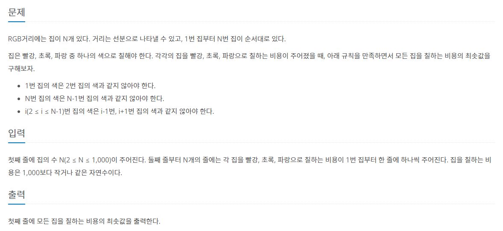

# 0727

## 1149 RGB 거리




```python
n = int(input())
colors = []
for i in range(n):
    colors.append(list(map(int, input().split(' '))))


for i in range(1, n):
    colors[i][0] += min(colors[i-1][1], colors[i-1][2])
    colors[i][1] += min(colors[i-1][0], colors[i-1][2])
    colors[i][2] += min(colors[i-1][0], colors[i-1][1])

print(min(colors[-1]))
```


## 1904 01타일

