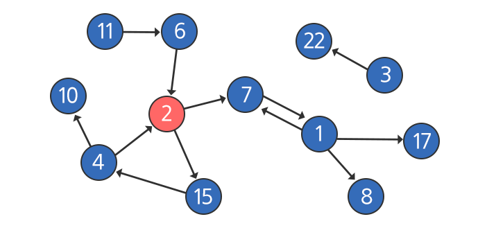
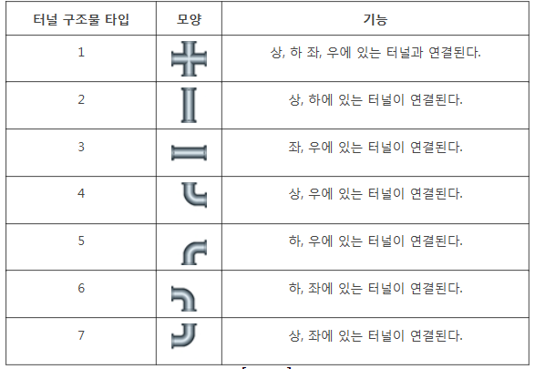
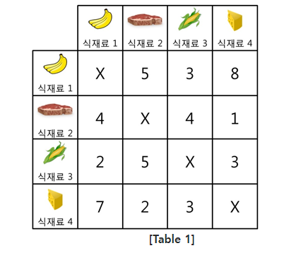

# 문제 풀이


## 1238 contact

> 비상연락망
>
> 가장 나중에 연락을 받게 되는 사람 중 번호가 가장 큰 사람을 구하는 문제.
>
> 최대 100명




### 접근

bfs로 하면 쉽게 접근할 수 있을 듯.


```python
def sd(v, cnt):
    global cnts
    global vs
    if len(tree[v]) == 1:
        vs += [v]
        cnts += [cnt]
    elif check[v] == 1:
        return
    else:
        check[v] = 1
        for i in range(1, len(tree[v])):
            sd(tree[v][i], cnt + 1)

for tc in range(1, 11):
    d, s = map(int, input().split())
    arr = list(map(int, input().split()))
    tree = [[0] for _ in range(101)]
    check = [0] * 101
    for i in range(d//2):
        tree[arr[2*i]] += [arr[2*i + 1]]
    cnts = []
    vs = []
    vss = 0
    sd(s, 0)

    for i in range(len(cnts)):
        if cnts[i] == max(cnts):
            if vs[i] > vss:
                vss = vs[i]
    print(f'#{tc} {vss}')
```

``` 
처음에 재귀로 시도 => but, bfs 는 재귀로 동작하지 않는다.
```

### 문제점

1. 일단 재귀로 하는 순간 return 이 제대로 작동하지 않는다.
2. 재귀를 하면 바깥의 함수가 재귀 안에 영향을 주지 못한다.


### ### bfs는 재귀로 동작하지 않는다. ### ###


```python
def bfs(s):
    q = []
    q.append(s)
    check[s] = 1

    while q:                # 큐가 있으면
        v = q.pop(0)            # 큐 처음 것으로 
        if tree[v]:                 # 자식이 있으면
            for i in range(len(tree[v])):       # 자식의 숫자만큼
                if check[tree[v][i]] == 0:      # 방문한적이 없다면
                    q.append(tree[v][i])        # 큐에 추가
                    check[tree[v][i]] = check[v] + 1    # 추가하면서 바로 visited에 깊이 표시

                    
                   
for i in range(d//2):		# tree 리스트 만들기
	tree[arr[2*i]] += [arr[2*i + 1]]
```


## 1861 정사각형 방

> NxN 형태의 N^2개의 방
>
> 상하좌우의 방 중에서 현재 방의 숫자보다 1큰 방이 있으면 그 방으로 이동 가능.
>
> 모든 방의 숫자는 다름.
>
> 최대로 이어진 방의 갯수를 구하는 문제


### 접근

모든 방의 숫자가 다르고 이동 방향도 무조건 한쪽 방향(현재 방보다 1큰 쪽)이므로

bfs dfs 필요 없을 듯.


1. n*n +1  크기의 배열 만들고 뭉쳐있는애들 구분하도록 만들면 굳이 bfs dfs 안만들어도 됨 => 겹치는 숫자가 없기 때문에 가능

2. 옆에 갈 수있는게 있으면 1 없으면 0 으로 표시

   연속된 1의 갯수로 구할 수 있음 


## 1953 탈주범 검거

> 탈주범은 시간당 1의 거리를 이동 가능
>
> 연결되어 있는 길로만 이동 가능
>
> 주어진 시간에 탈주범이 위치할 수 있는 장소의 개수를 구하는 문제.



### 접근

시간에 따라 한칸 씩 이동하기 때문에 bfs 사용하면 편할 듯. 

BFS

* 미로, 특정위치/조건까지의 거리/단계 수 등 한단계씩 탐색하면서 답을 찾는 경우
  * 이 때 조건에 따라 중복방문을 방지해야 할수도 허용해야 할수도 있음.


* bfs 로 접근하지 말아야 하는 경우
  * => 시간복잡도를 기준으로
  * 10^3 x 10^3 넘으면 bfs 어려움


```python
def search(i, j, cnt):        
    # global p
    q = []
    if cnt == l:
        return
    else:
        visited[i][j] += 1
        q.append((i,j))
        # p += 1
        # cnt += 1
        for k in range(4):					# 터널이 연결되어 있다면 다음 좌표 재귀함수로 
            if k == 0 and td[arr[i][j]][k] == 1:
                if 0 <= i-1 < n and arr[i-1][j] != 0 and td[arr[i - 1][j]][1] == 1 and visited[i-1][j] == 0:
                    search(i-1, j, cnt+1)

            elif k == 1 and td[arr[i][j]][k] == 1:
                if 0 <= i + 1 < n and arr[i+1][j] != 0 and td[arr[i + 1][j]][0] == 1 and visited[i+1][j] == 0:
                    search(i+1, j, cnt+1)

            elif k == 2 and td[arr[i][j]][k] == 1:
                if 0 <= j - 1 < m and arr[i][j - 1] != 0 and td[arr[i][j - 1]][3] == 1 and visited[i][j-1] == 0:
                    search(i, j-1, cnt+1)

            elif k == 3 and td[arr[i][j]][k] == 1:
                if 0 <= j + 1 < m and arr[i][j + 1] != 0 and td[arr[i][j + 1]][2] == 1 and visited[i][j+1] == 0:
                    search(i, j+1, cnt+1)
        else:
            return
```

### 문제점

1. 일단 경로가 겹칠경우, 먼저 작동하는 재귀에 의해서 visited가 1로 변경되어 새로운 루트에서 깊게 들어가지 못하는 상황이 발생.

   => bfs는 재귀로 하지말자...


## 1486 장훈이의 높은 선반

>직원끼리 만들 수 있는 탑 중에 선반과 차이가 가장 작은 높이를 출력하는 문제


### 접근

직원들로 탑을 만들 때, 결국 부분집합을 만드는 것처럼 만들 수 있음.

가능한 모든 경우를 처리

가지치기는 그후, 마지막에 고려한다.


```python
def top(i, n, s, t):
    global ss
    if s >= b:
        if s < ss:
            ss = s
            return
    elif s + t < b:
        return
    elif i == n:
        return
    else:
        top(i+1, n, s, t-ll[i])
        top(i+1, n, s + ll[i], t-ll[i])

for tc in range(1, int(input())+1):
    n, b = map(int, input().split())
    ll = list(map(int, input().split()))
    total = 0
    for l in ll:
        total += l
    ss = 100000
    top(0, n, 0, total)
    print(f'#{tc} {ss-b}')
```


이 문제는 쉽게 푼듯

### ### 부분집합으로 푸는 문제의 경우

2^50 가지 경우의 수 => 가지차기 정말 잘하면 될수도.. 그 위면 절대 금지


## 4012 요리사

> N(짝수)개의 식재료로 2개의 음식을 만듦
>
> 2개의 음식의 맛의 차이가 가장 적을 때를 구하는 문제.




### 접근

그냥 combination으로 N개의 식재료중 N/2개를 뽑는 방식으로 하면 될듯.


```python
def p(i, n):                # nC가 아니라 nP 인 상태
    food1 = 0
    food2 = 0
    global cnt
    global ff
    if i == n//2:           # 앞에 반개만 뽑아 내면 뒷부분은 똑같기 때문에 상관없음
        cnt += 1
        for j in range(n//2):
            for k in range(j+1, n//2):
                food1 += taste[foods[j]][foods[k]] + taste[foods[k]][foods[j]]
        for j in range(n//2, n):
            for k in range(j+1, n):
                food2 += taste[foods[j]][foods[k]] + taste[foods[k]][foods[j]]
        f = abs(food1 - food2)
        ff += [f]
        print(foods)
    else:
        for j in range(i,n):            # i번째 원소를 정하는 과정 
            foods[i], foods[j] = foods[j], foods[i]
            p(i+1, n)
            foods[i], foods[j] = foods[j], foods[i]


for tc in range(1, int(input())+1):
    n = int(input())
    taste = [list(map(int, input().split())) for _ in range(n)]
    foods = [i for i in range(n)]
    cnt = 0
    ff = []
    p(0,n)
    print(cnt)
    print(f'#{tc} {min(ff)}')
```

### 한계

1. 잘 돌아가지만, 시간이 너무 오래걸림.
2. 조합이 아니라 순열이라서 그런듯 => 조합을 못만들겠다.

16P8 = 518918400 => 내 첫 풀이 ( 시간초과)

16C8 = 12870

2^16 = 65536 => 교수님 (252ms)


### 교수님 풀이

```python
def dfs(i, al, bl):     
    global ans
    global cnt

    if i == n:
        cnt += 1
        print(al, bl)
        if len(al) == len(bl):
            food1 = 0
            food2 = 0
            for j in range(n//2):
                for k in range(j+1, n//2):
                    food1 += taste[al[j]][al[k]] + taste[al[k]][al[j]]
                    food2 += taste[bl[j]][bl[k]] + taste[bl[k]][bl[j]]
                    f = abs(food1-food2)

            if f < ans:
                ans = f
        return
    dfs(i + 1, al + [i], bl)        # 원소를 a음식에 넣을지 b음식에 넣을 지 선택하는 과정 => 부분집합만드는 과정이랑 같음
    dfs(i + 1, al, bl + [i])


for tc in range(1, int(input())+1):
    n = int(input())
    taste = [list(map(int, input().split())) for _ in range(n)]
    foods = [i for i in range(n)]
    ans = 100000
    cnt = 0
    dfs(0, [], [])
    print(cnt)
    print(f'#{tc} {ans}')
```


### ### combination 구현 하고 다시풀자


### combination 구현

```python
a = [1, 2, 3, 4, 5, 6]

cnt = 0

def c(n, r, lst):
    global cnt
    if r == 0:
        cnt += 1
        print(lst)
        return
    else:
        for i in range(n):
            if not lst:
                lst += [a[i]]
                c(n, r - 1, lst)
                lst.pop()
            else:
                if a[i] not in lst and a[i] > max(lst):
                    lst += [a[i]]
                    c(n, r-1, lst)
                    lst.pop()
c(len(a),2,[])
print(cnt)
```

```
[1, 2] [1, 3] [1, 4] [1, 5] [1, 6] [2, 3] [2, 4] [2, 5] [2, 6] [3, 4] [3, 5] [3, 6] [4, 5] [4, 6] [5, 6] 15
```

= > 중복 피하기 위해  a[i] > max(lst): 추가함.


### 요리사문제 combination으로 풀면

```python
def p(n, r, al):                # nCr
    food1 = 0
    food2 = 0
    # global cnt
    global minv
    if r == 0:            
        # cnt += 1
        bl = []
        for i in range(n):
            if i not in al:
                bl +=[i]
        for i in range(n//2):
            for j in range(i+1, n//2):
                food1 += taste[al[i]][al[j]] + taste[al[j]][al[i]]
        for i in range(n//2):
            for j in range(i+1, n//2):
                food2 += taste[bl[i]][bl[j]] + taste[bl[j]][bl[i]]
        f = abs(food1 - food2)
        if f < minv:
            minv = f
    else:								
        for i in range(n):
            if not al:
                al += [i]
                p(n, r-1, al)
                al.pop()
            else:
                if i not in al and i > max(al):
                    al += [i]
                    p(n, r - 1, al)
                    al.pop()
```

### 근데 시간이 더 오래걸리네...


## 가능한 시험점수

> 입력받은 시험 배점에 대하여 받을 수 있는 점수의 경우의 수를 구하는 문제


### 접근

처음에 부분집합 하려 했는데

문제문항이 최대 100 => 시간이 2^100 => 시간초과

100문항에 배점 100점씩 해도 최대 10000점이므로 최대점수크기의 리스트를 만들고 진행


```python
for tc in range(1, int(input()) + 1):
    n = int(input())
    score = list(map(int, input().split()))
    m = 0
    for i in range(n):
        m += score[i]
    scores = [0] * (m+1)
    scores[0] = 1
    for s in score:
        for i in range(len(scores)-1,-1,-1):   # 앞에서부터 세면 i가 작은값부터 진행되기 때문에  하나의 숫자로 여러칸을 채우기 때문에 뒤에서부터
            if scores[i]:
                scores[i+s] = 1             # i는 이전의 가능한점수 s는 새로들어온 점수
    cnt = 0
    for i in range(len(scores)):
        if scores[i] == 1:
            cnt += 1
    print(f'#{tc} {cnt}')
```


### i 접근을 앞에서부터 하면 같은 s로 여러 칸의 scores가 채워지기 때문에 무조건 뒤에서부터 진행 


